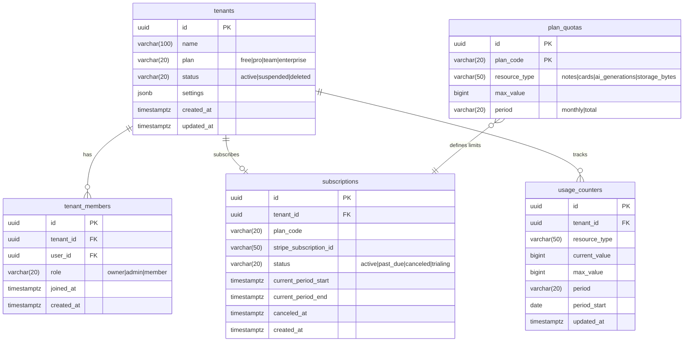
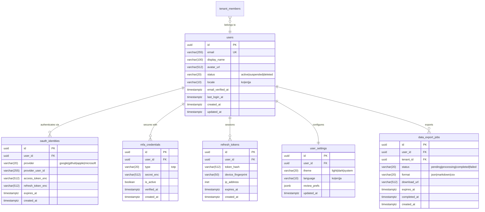
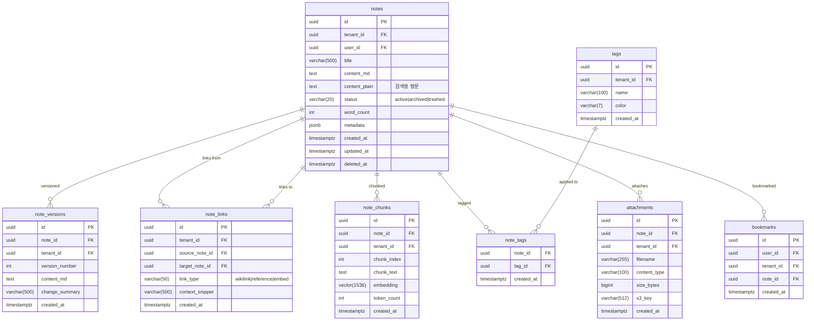
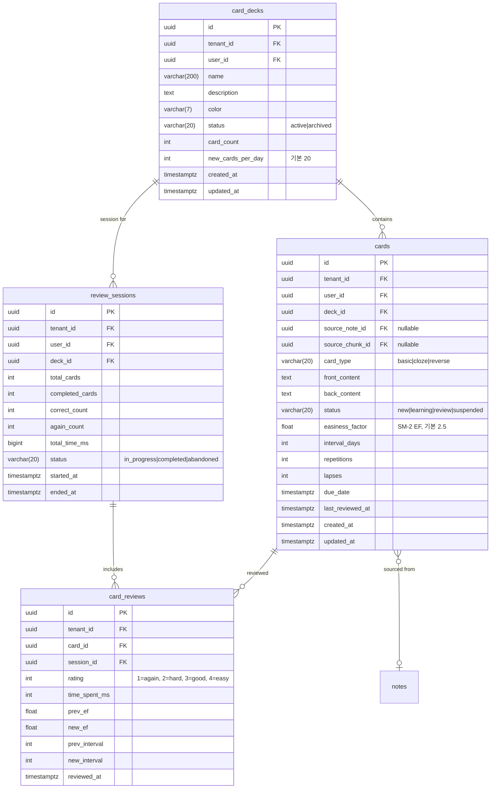
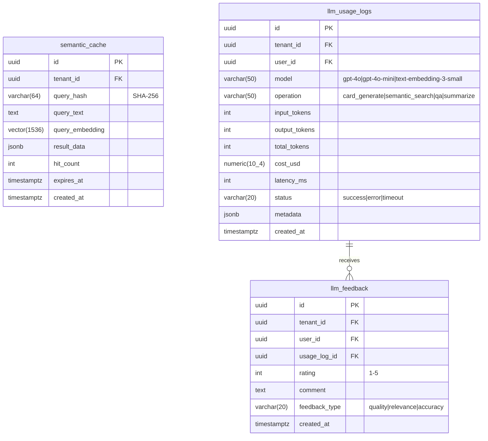
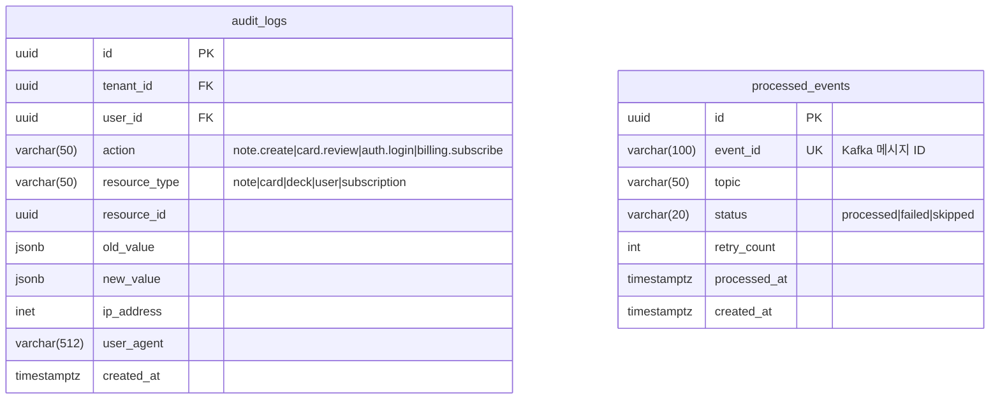
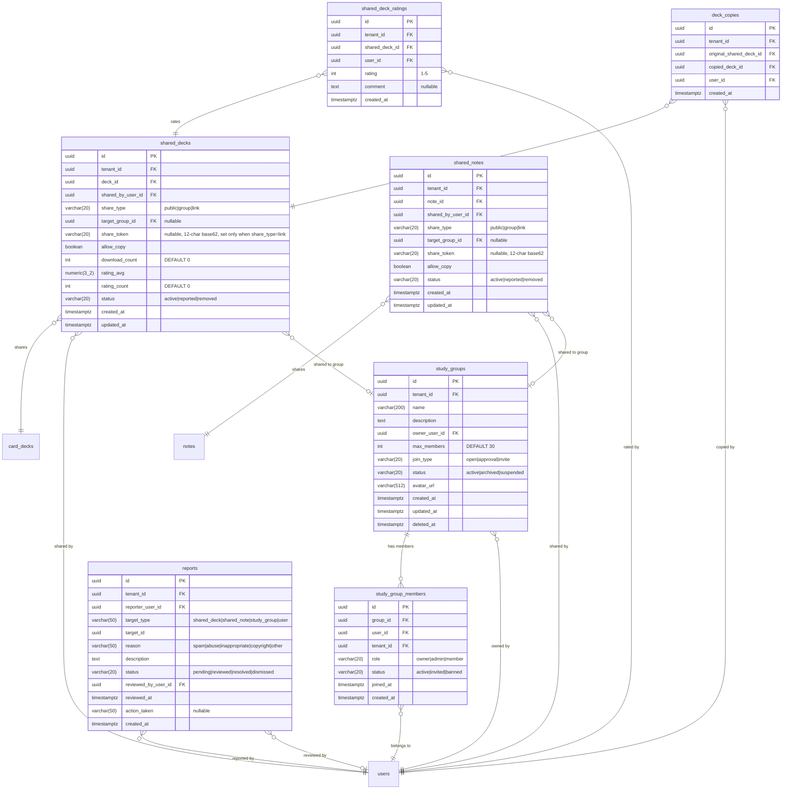
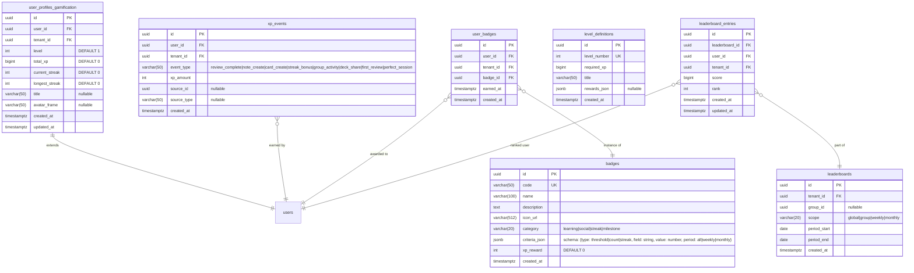
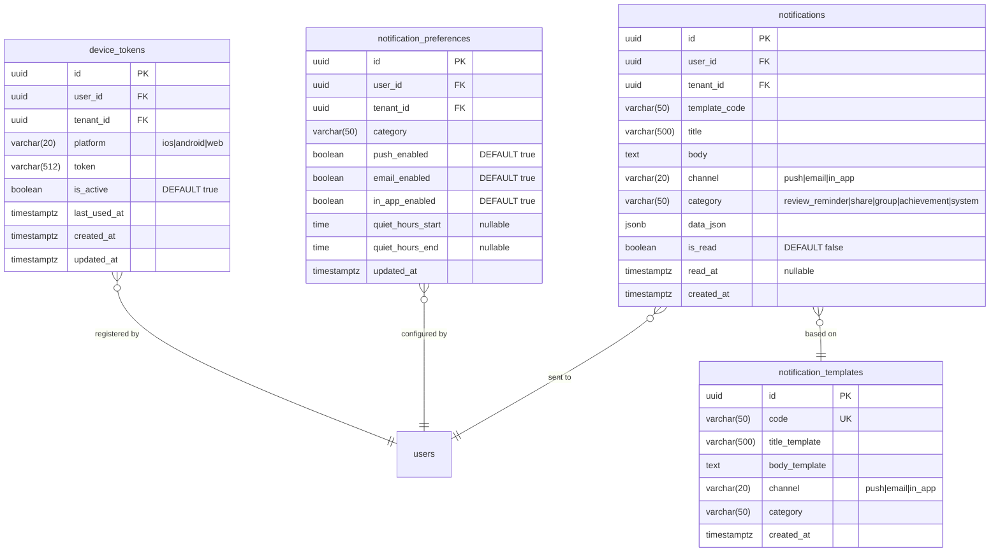

# 2. ERD 문서

> **프로젝트명**: Synapse — 통합 학습-지식 그래프 SaaS
> **버전**: v1.0
> **작성일**: 2026-05-07
> **기술 스택**: Spring Boot 4, Flutter 3.x, FastAPI, PostgreSQL 16, Redis, Elasticsearch, Kafka, K8s

---

## 2.1 데이터베이스 설계 원칙

### 멀티테넌시 전략

- **모델**: Pool (단일 DB, 공유 스키마)
- **격리**: Row Level Security (RLS) + 애플리케이션 레벨 tenant_id 강제 필터
- **인덱스 규칙**: 모든 인덱스는 `tenant_id`를 prefix로 포함

### 공통 컬럼 규약

| 컬럼 | 타입 | 설명 |
|------|------|------|
| id | UUID (v7) | PK, 시간 순서 보장 |
| tenant_id | UUID | FK → tenants.id, NOT NULL |
| created_at | TIMESTAMPTZ | 생성 시각, DEFAULT now() |
| updated_at | TIMESTAMPTZ | 수정 시각, 트리거 자동 갱신 |
| deleted_at | TIMESTAMPTZ | 소프트 삭제, NULL = 활성 |

---

## 2.2 ERD 다이어그램

### 2.2.1 테넌시/빌링 도메인



### 2.2.2 인증/사용자 도메인



### 2.2.3 노트 도메인



### 2.2.4 카드/SRS 도메인



### 2.2.5 AI/RAG 도메인



### 2.2.6 감사 도메인



### 2.2.7 커뮤니티 도메인



> **MVP 제외 항목**: `shared_notes.allow_edit` — OT/CRDT 기반 협업 편집이 필요하므로 Phase 3+ 이후 구현 예정.

### 2.2.8 게이미피케이션 도메인



> **리더보드 스코프 주의**: `global` 스코프는 테넌트 전체 기준이며 RLS 정책을 준수합니다 (타 테넌트 데이터 노출 없음).

### 2.2.9 알림 도메인



> **data_json 예시**:
> - `review_reminder`: `{"dueCount": 15, "deckName": "프로그래밍"}`
> - `share`: `{"sharedBy": "김시냅스", "deckTitle": "ML기초"}`
> - `achievement`: `{"badgeCode": "STREAK_7", "badgeName": "일주일 전사"}`
> - `group`: `{"groupName": "ML스터디", "action": "new_member"}`

---

## 2.3 인덱스 설계 규칙

### 네이밍 컨벤션

```
idx_{table}_{columns}
uq_{table}_{columns}
```

### 핵심 인덱스

| 테이블 | 인덱스 | 컬럼 | 타입 |
|--------|--------|------|------|
| notes | idx_notes_tenant_user | (tenant_id, user_id, deleted_at) | B-tree |
| notes | idx_notes_tenant_status | (tenant_id, status, updated_at DESC) | B-tree |
| note_links | idx_note_links_target | (tenant_id, target_note_id) | B-tree |
| note_chunks | idx_note_chunks_embedding | (embedding) | IVFFlat (lists=100) |
| cards | idx_cards_tenant_due | (tenant_id, user_id, status, due_date) | B-tree |
| cards | idx_cards_deck | (tenant_id, deck_id, status) | B-tree |
| card_reviews | idx_card_reviews_card | (tenant_id, card_id, reviewed_at DESC) | B-tree |
| audit_logs | idx_audit_tenant_time | (tenant_id, created_at DESC) | B-tree |
| semantic_cache | idx_semantic_cache_hash | (tenant_id, query_hash) | B-tree |
| semantic_cache | idx_semantic_cache_vec | (query_embedding) | HNSW (m=16, ef=64) |
| study_groups | idx_study_groups_tenant | (tenant_id, status, created_at DESC) | B-tree |
| study_groups | idx_study_groups_owner | (tenant_id, owner_user_id) | B-tree |
| study_group_members | idx_sgm_group | (tenant_id, group_id, status) | B-tree |
| study_group_members | idx_sgm_user | (tenant_id, user_id, status) | B-tree |
| uq_sgm_group_user | uq_study_group_members_group_user | (group_id, user_id) | UNIQUE |
| shared_decks | idx_shared_decks_tenant | (tenant_id, share_type, status) | B-tree |
| shared_decks | idx_shared_decks_group | (tenant_id, target_group_id, status) | B-tree |
| shared_decks | idx_shared_decks_token | (share_token) WHERE share_token IS NOT NULL | B-tree |
| shared_notes | idx_shared_notes_tenant | (tenant_id, share_type, status) | B-tree |
| shared_notes | idx_shared_notes_token | (share_token) WHERE share_token IS NOT NULL | B-tree |
| reports | idx_reports_tenant_status | (tenant_id, status, created_at DESC) | B-tree |
| xp_events | idx_xp_events_user | (tenant_id, user_id, created_at DESC) | B-tree |
| user_badges | idx_user_badges_user | (tenant_id, user_id, earned_at DESC) | B-tree |
| leaderboard_entries | idx_lb_entries_leaderboard | (leaderboard_id, rank ASC) | B-tree |
| notifications | idx_notifications_user | (tenant_id, user_id, is_read, created_at DESC) | B-tree |
| device_tokens | idx_device_tokens_user | (tenant_id, user_id, is_active) | B-tree |

### 파티셔닝 전략

```sql
-- audit_logs: 월별 파티셔닝
CREATE TABLE audit_logs (
    ...
) PARTITION BY RANGE (created_at);

CREATE TABLE audit_logs_2026_01 PARTITION OF audit_logs
    FOR VALUES FROM ('2026-01-01') TO ('2026-02-01');

-- card_reviews: 월별 파티셔닝
CREATE TABLE card_reviews (
    ...
) PARTITION BY RANGE (reviewed_at);
```

---

## 2.4 RLS 정책 예시

### 기본 RLS 정책

```sql
-- notes 테이블 RLS
ALTER TABLE notes ENABLE ROW LEVEL SECURITY;

CREATE POLICY notes_tenant_isolation ON notes
    USING (tenant_id = current_setting('app.current_tenant_id')::uuid);

CREATE POLICY notes_user_access ON notes
    FOR ALL
    USING (
        tenant_id = current_setting('app.current_tenant_id')::uuid
        AND (
            user_id = current_setting('app.current_user_id')::uuid
            OR current_setting('app.current_role') = 'admin'
        )
    );
```

### 테넌트 컨텍스트 설정

```sql
-- 요청마다 Gateway에서 설정
SET LOCAL app.current_tenant_id = 'tenant-uuid-here';
SET LOCAL app.current_user_id = 'user-uuid-here';
SET LOCAL app.current_role = 'member';
```

### 커뮤니티 도메인 RLS 정책

```sql
-- shared_decks: tenant_id 격리 + share_type 기반 접근 제어
ALTER TABLE shared_decks ENABLE ROW LEVEL SECURITY;

CREATE POLICY shared_decks_access ON shared_decks
    FOR SELECT
    USING (
        tenant_id = current_setting('app.current_tenant_id')::uuid
        AND status = 'active'
        AND (
            -- public: 테넌트 내 전체 접근
            share_type = 'public'
            -- group: 그룹 멤버만 접근
            OR (share_type = 'group' AND EXISTS (
                SELECT 1 FROM study_group_members sgm
                WHERE sgm.group_id = shared_decks.target_group_id
                  AND sgm.user_id = current_setting('app.current_user_id')::uuid
                  AND sgm.status = 'active'
            ))
            -- link: share_token 일치 시 접근 (애플리케이션 레벨에서 토큰 검증)
            OR share_type = 'link'
            -- 공유자 본인은 항상 접근 가능
            OR shared_by_user_id = current_setting('app.current_user_id')::uuid
        )
    );

-- study_groups: tenant_id 격리 + 멤버 가시성
ALTER TABLE study_groups ENABLE ROW LEVEL SECURITY;

CREATE POLICY study_groups_access ON study_groups
    FOR SELECT
    USING (
        tenant_id = current_setting('app.current_tenant_id')::uuid
        AND (
            join_type = 'open'
            OR owner_user_id = current_setting('app.current_user_id')::uuid
            OR EXISTS (
                SELECT 1 FROM study_group_members sgm
                WHERE sgm.group_id = study_groups.id
                  AND sgm.user_id = current_setting('app.current_user_id')::uuid
                  AND sgm.status = 'active'
            )
        )
    );

-- notifications: user_id + tenant_id 격리
ALTER TABLE notifications ENABLE ROW LEVEL SECURITY;

CREATE POLICY notifications_user_isolation ON notifications
    FOR ALL
    USING (
        tenant_id = current_setting('app.current_tenant_id')::uuid
        AND user_id = current_setting('app.current_user_id')::uuid
    );
```

---

## 2.5 데이터 흐름 요약

```
노트 작성 → notes INSERT
         → note_versions INSERT (비동기)
         → note_links UPSERT (위키링크 파싱)
         → note_chunks INSERT (청킹 + 임베딩, 비동기)
         → Elasticsearch 인덱싱 (Kafka)

카드 생성 → cards INSERT
         → card_decks.card_count UPDATE

복습 제출 → card_reviews INSERT
         → cards UPDATE (SM-2 계산)
         → review_sessions UPDATE
         → usage_counters INCREMENT (Kafka)
         → Kafka: card.reviewed 발행

[커뮤니티 도메인]
덱 공유   → shared_decks INSERT
         → Kafka: community.deck.shared 발행
         → Notification Service: 그룹 멤버 알림 생성 (group share_type 시)

노트 공유 → shared_notes INSERT
         → Kafka: community.note.shared 발행

덱 복사   → Community Service → Card Service 내부 API (POST /internal/decks/copy)
         → deck_copies INSERT
         → shared_decks.download_count INCREMENT

그룹 생성 → study_groups INSERT
         → study_group_members INSERT (owner)
         → Kafka: community.group.created 발행

신고 접수 → reports INSERT (중복 신고 방지 + 일 10건 제한 적용)
         → Kafka: community.report.created 발행

[게이미피케이션 도메인]
XP 적립   → xp_events INSERT
         → user_profiles_gamification.total_xp UPDATE
         → 레벨 상승 판정 → level_definitions 조회
         → 배지 판정 (criteria_json 동기 평가)
         → Kafka: gamification.xp.earned 발행
         → Kafka: gamification.badge.earned 발행 (배지 획득 시)
         → Kafka: gamification.level.up 발행 (레벨 업 시)

리더보드  → Cron Job (주간/월간 자동 생성) → leaderboards INSERT
         → leaderboard_entries UPSERT
         → Redis Sorted Set 캐시 갱신

스트릭 관리 → daily Cron Job → current_streak 리셋 (어제 활동 없는 경우)
           → Kafka: gamification.xp.earned (streak_bonus 이벤트)

[알림 도메인]
알림 생성 → Kafka consumer (card.review.due, gamification.*, community.*)
         → notification_preferences 조회 (quiet_hours, 채널 설정)
         → notifications INSERT
         → FCM/APNs 발송 (push 채널)
         → AWS SES 발송 (email 채널, P1)

로그아웃  → device_tokens.is_active = false (해당 기기 토큰 비활성화)
```

---

## 2.6 마이그레이션 전략

- **도구**: Flyway 10.x
- **네이밍**: `V{version}__{description}.sql`
- **규칙**:
  - DDL과 DML 분리
  - 모든 마이그레이션 되돌리기 가능하도록 작성
  - 대용량 테이블 변경 시 `CREATE INDEX CONCURRENTLY` 사용
  - RLS 정책은 별도 마이그레이션 파일로 관리
