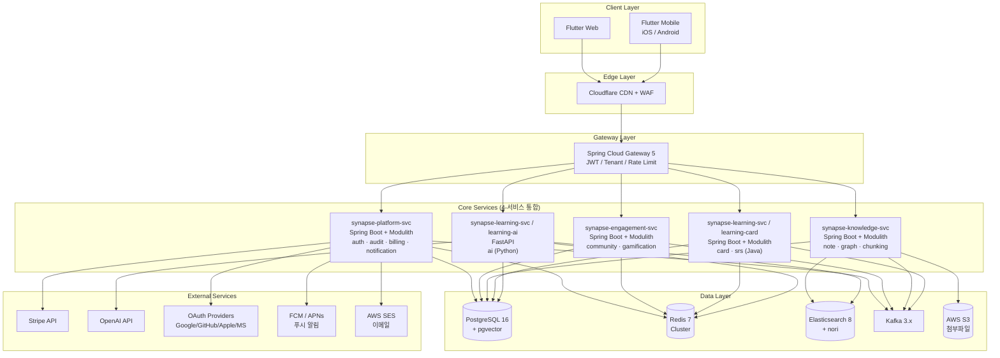
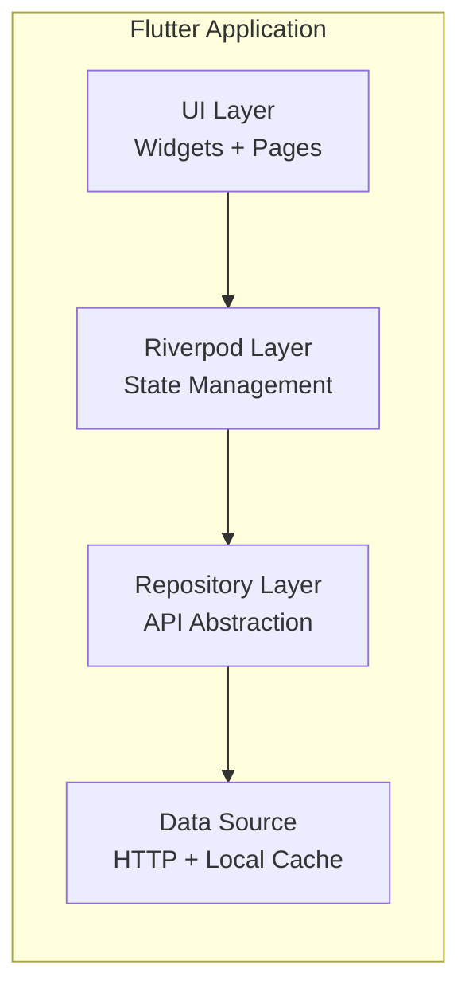
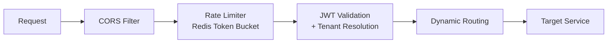
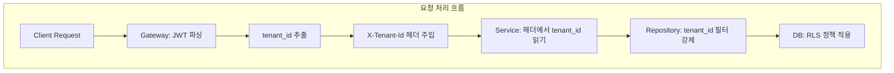
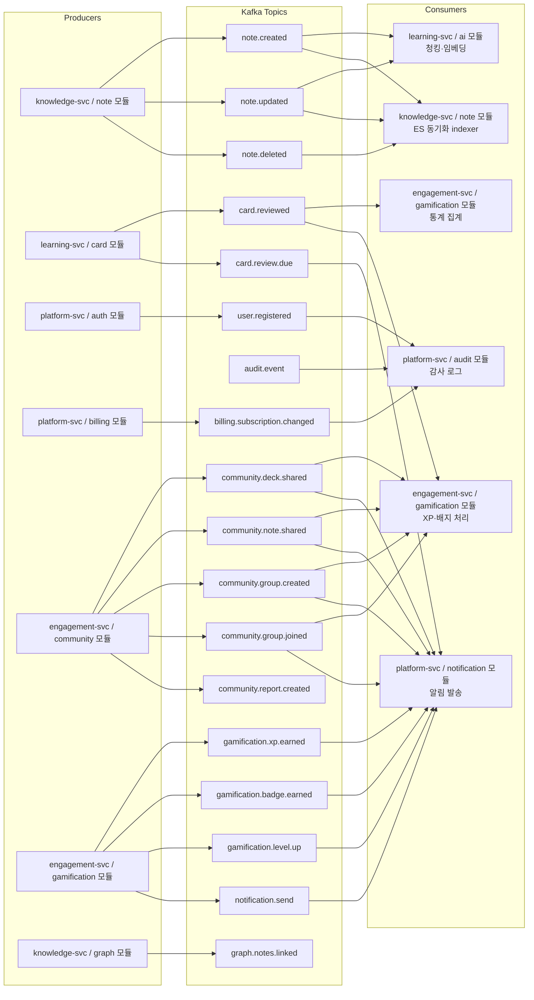
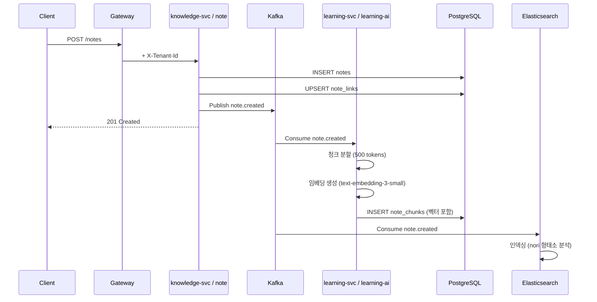
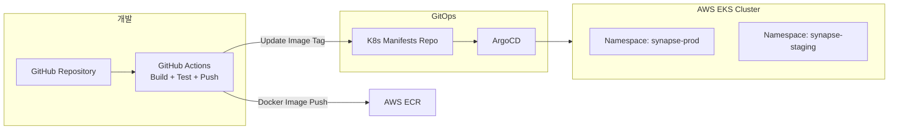

# 3. 프로젝트 아키텍처 정의서

> **프로젝트명**: Synapse — 통합 학습-지식 그래프 SaaS
> **버전**: v2.0
> **작성일**: 2026-05-07
> **수정일**: 2026-05-09
> **기술 스택**: Spring Boot 4, Flutter 3.x, FastAPI, PostgreSQL 16, Redis, Elasticsearch, Kafka, K8s

> ⚠️ **v2.0 전면 개편 안내**
>
> 본 문서는 ADR-001 (10→4 서비스 통합) / ADR-002 (AI Service 통합) — 채택일 2026-05-09 — 을 반영하여 갱신되었다. 자세한 결정 근거와 운영 규칙은 `09_Git_규칙_정의서` v2.0 (§0.1 ADR 요지 / §B1 레포 구조 / §B4 Schema Registry / Appendix A·B ADR 전문) 참조.
>
> 본 v2.0과 함께 / 이후 갱신되는 위키 문서:
>  - `09_Git_규칙_정의서` v2.0 (이미 채택 완료)
>  - `03_프로젝트_아키텍처_정의서` v2.0 (그룹 1 — 본 사이클)
>  - `18_기술_스택_정의서` v2.0 (그룹 1 — 본 사이클)
>  - `14_배포_가이드` v2.0 (그룹 2 — 다음 사이클)
>  - `10_환경_설정_템플릿` v2.0 (그룹 2 — 다음 사이클)
>  - `17_스케줄` v2.0 (그룹 3 — 다음 사이클)

---

## 4-서비스 통합 결정 (ADR-001 / ADR-002)

Synapse는 원안의 10개 마이크로서비스를 4개의 굵은 서비스(synapse-platform-svc / synapse-engagement-svc / synapse-knowledge-svc / synapse-learning-svc)로 통합하고, 각 서비스 내부는 Spring Modulith 모듈로 분리한다. AI Service는 learning-svc 안의 별도 컨테이너(learning-ai)로 운영한다. 채택일 2026-05-09. 결정 근거(7명 팀의 콘웨이 법칙·운영 비용 30% 절감·미래 분리 옵션 보존)와 ADR 전문은 `09_Git_규칙_정의서` v2.0 §0.1 / Appendix A·B 참조.

### 트랙 ↔ 레포 ↔ Owner 매핑

| 트랙 | 인원 | 담당 레포 | 통합 원본 도메인 | 영문 handle |
|---|:---:|---|---|---|
| 팀장 | 1 | (전 영역 cross-review + 인프라/공통) | — | `@team-lead` |
| 트랙 A | 1 | synapse-platform-svc | Auth + Audit + Billing + Notification | `@platform-owner` |
| 트랙 B | 1 | synapse-engagement-svc | Community + Gamification | `@engagement-owner` |
| 트랙 C | 2 | synapse-knowledge-svc | Note + Graph + Chunking | `@knowledge-owner-1`, `@knowledge-owner-2` |
| 트랙 D | 2 | synapse-learning-svc (Java + Python) | Card + SRS + AI | `@learning-card-owner` (Java), `@learning-ai-owner` (Python) |
| 협업 | 전체 | synapse-frontend (Flutter) | UI | `@team-lead` + 모든 owner |
| 단독 관리 | 팀장 | synapse-shared, synapse-gitops, synapse-mirror | Avro / K8s manifest / 미러 | `@team-lead` |

> 본 매핑은 `09_Git_규칙_정의서` §0.3과 동일. 본 03 v2.0의 모든 절은 이 4 서비스를 전제로 작성된다.

---

## 3.1 시스템 아키텍처 개요

### 전체 아키텍처 다이어그램



---

## 3.2 레이어별 상세 설계

### 3.2.1 Edge Layer (Cloudflare)

| 기능 | 설명 |
|------|------|
| CDN | Flutter Web 정적 자산 캐싱 (HTML/JS/CSS/WASM) |
| WAF | OWASP 규칙, Rate Limiting (IP 기반) |
| DDoS | L3/L4/L7 DDoS 방어 |
| SSL | 전구간 TLS 1.3 |
| DNS | synapse.app 도메인 관리 |

### 3.2.2 Client Layer (Flutter 3.x)



| 플랫폼 | 빌드 | 배포 |
|---------|------|------|
| Web | Flutter Web (CanvasKit) | Cloudflare Pages |
| iOS | Flutter iOS | App Store |
| Android | Flutter Android | Google Play |

### 3.2.3 Gateway Layer (Spring Cloud Gateway 5)



**Gateway 필터 체인:**

1. **CORS Filter**: 허용 Origin 검증
2. **Rate Limiter**: Redis Token Bucket (플랜별 차등)
3. **JWT Validator**: Access Token 검증 + 클레임 추출
4. **Tenant Resolver**: JWT에서 tenant_id 추출 → X-Tenant-Id 헤더 주입
5. **Request Logger**: 요청 메타데이터 Kafka 발행
6. **Circuit Breaker**: Resilience4j 기반 서킷 브레이커

**Rate Limit 정책:**

| 플랜 | API 호출 | AI 호출 | Burst |
|------|----------|---------|-------|
| Free | 100/min | 10/day | 20 |
| Pro | 1000/min | 500/month | 100 |
| Team | 3000/min | 1000/month | 200 |

### 3.2.4 Core Services (4-서비스 + 내부 모듈)

각 서비스는 단일 git 레포로 운영되며 Spring Modulith로 내부 모듈을 분리한다. 모듈 경계는 ArchUnit으로 검증된다 (CI 자동화 — `09_Git_규칙_정의서` §A3 참조). 미래에 트래픽이 한 모듈에 집중되면 그 모듈을 별도 서비스로 추출하는 옵션을 보존한다.

#### synapse-platform-svc (1명 owner — 트랙 A `@platform-owner`)

> Cross-cutting + 외부 SaaS 통합. 비즈니스 로직 단순, 외부 API 위주.

| 모듈 | 책임 |
|------|------|
| `auth/` | OAuth 2.0 (Google/GitHub/Apple/Microsoft 연동), JWT 발급 (Access 15분 + Refresh 7일 httpOnly Cookie), MFA TOTP, Redis 기반 Refresh Token 관리, 가입 시 자동 테넌트 생성 + 초대 가입 |
| `audit/` | Kafka 이벤트 소비 → audit_logs 적재, processed_events 기반 Idempotency, 관리자 감사 로그 검색 API, 90일 보존 → Cold Storage 이관 |
| `billing/` | Free/Pro/Team/Enterprise 플랜 정의, Stripe Checkout Session / Customer Portal, Webhook 처리 (결제 성공·실패·구독 변경), usage_counters 기반 사용량 제한 (403 반환), Stripe Invoice 조회 |
| `notification/` | Kafka 이벤트 소비 → notification_preferences 확인 → notifications INSERT, FCM (Android/Web) / APNs (iOS) 푸시, AWS SES 이메일, 인앱 알림 (Redis 미읽음 카운트), notification_preferences CRUD (quiet_hours), `card.review.due` 복습 리마인더, device_tokens 등록·삭제 |

외부 의존성: Google/GitHub/Apple/Microsoft OAuth · Stripe API + Webhook · FCM / APNs / AWS SES · AWS Secrets Manager.

#### synapse-engagement-svc (1명 owner — 트랙 B `@engagement-owner`)

> 사용자 참여·동기 부여. 외부 의존 적고 다른 서비스 이벤트 소비 중심.

| 모듈 | 책임 |
|------|------|
| `community/` | 스터디 그룹 CRUD (생성·수정·삭제·가입 신청·승인·거절·초대), 멤버 역할 변경 (owner/admin/member·강퇴·밴), 덱·노트 공유 (public/group/link, share_token 발급), 신고 접수 (동일 타겟 중복 방지·사용자당 일 10건 제한) |
| `gamification/` | xp_events INSERT → total_xp 업데이트 → 레벨 상승 판정, level_definitions 기반 레벨 업, criteria_json 동기 평가 배지 수여, Cron Job으로 주간/월간 leaderboards 자동 생성, daily Cron Job 스트릭 리셋 |

의존성: PostgreSQL · Redis (리더보드 Sorted Set 캐시) · Kafka (`card.reviewed` / `note.created` / `community.*` 소비 + `gamification.*` 발행) · learning-svc internal API (`/internal/decks/copy`).

#### synapse-knowledge-svc (2명 owner — 트랙 C `@knowledge-owner-1` / `@knowledge-owner-2`)

> 노트 + 지식 그래프. Synapse 정체성의 Core 도메인.

| 모듈 | 책임 |
|------|------|
| `note/` | Markdown CRUD (저장·조회·수정·삭제), 위키링크 `[[...]]` 파싱 → note_links 갱신, 저장 시 note_versions 생성, S3 Presigned URL 첨부파일, Elasticsearch 동기화 (Kafka) |
| `graph/` | 백링크 조회 (특정 노트를 가리키는 모든 노트), 노드(노트) + 엣지(링크) → D3.js 시각화 데이터, 주기적 PageRank 계산 (중요 노트 식별), 관련 노트 그룹 자동 클러스터링 |
| `chunking/` | 비동기 청크 분할, learning-ai 호출 통한 임베딩 생성, pgvector 적재 |

의존성: PostgreSQL · Elasticsearch · AWS S3 · Kafka 발행 (`note.created/updated/deleted` / `graph.notes.linked`) · Kafka 소비 (`user.deleted` 정리).

#### synapse-learning-svc (2명 owner — 트랙 D `@learning-card-owner` Java / `@learning-ai-owner` Python)

> 학습 + AI. 가장 큰 서비스. Java + Python 두 컨테이너.

| 컨테이너 / 모듈 | 책임 |
|------|------|
| `learning-card` (Java / Spring Boot) — `card/`, `srs/` | 카드/덱 CRUD (수동 카드 관리), SM-2 알고리즘 기반 due_date 계산, 오늘의 복습 카드 조회 (due_date <= now), rating → SM-2 → 다음 복습일, review_sessions 시작·완료·통계 |
| `learning-ai` (Python / FastAPI) — `ai/` | 노트 텍스트 → LLM → 카드 자동 생성 (basic/cloze), 쿼리 임베딩 → pgvector 시맨틱 검색, 시맨틱 + BM25 RRF 하이브리드, RAG 기반 Q&A, 시맨틱 캐시 (코사인 유사도 > 0.95), 토큰/비용 사용량 추적 |

K8s 배치: 두 Deployment로 분리 (`learning-card-deployment` / `learning-ai-deployment`). 인터페이스: Kafka 이벤트 + Internal REST API.

의존성: PostgreSQL + pgvector · Redis · Elasticsearch · OpenAI API · Anthropic Claude API · Kafka 소비 (`note.created` 자동 카드 생성 / `note.updated`) · Kafka 발행 (`card.reviewed` / `card.review.due`).

> 4-서비스 통합 근거·서비스별 owner 책임·미래 분리 로드맵 등 상세는 `SYNAPSE_Service_Consolidation.md` §2 / `09_Git_규칙_정의서` §0 참조.

---

## 3.3 멀티테넌시 모델

### 아키텍처 결정



### 3단계 격리

| 레벨 | 구현 | 목적 |
|------|------|------|
| L1: Gateway | JWT → tenant_id 추출 + 헤더 주입 | 인증된 테넌트만 진입 |
| L2: Application | BaseRepository에서 tenant_id WHERE 강제 | 코드 레벨 격리 |
| L3: Database | PostgreSQL RLS 정책 | DB 레벨 최종 방어선 |

### Tenant Context Propagation

```java
// HibernateInterceptor 레벨에서 모든 DB 연결에 tenant context 주입
// AOP @Transactional이 아닌 Interceptor 레벨이므로 모든 쿼리에 자동 적용
@Component
public class TenantConnectionInterceptor implements StatementInspector {
    @Override
    public String inspect(String sql) {
        UUID tenantId = TenantContext.getCurrent();
        if (tenantId != null) {
            // UUID 검증 (SQL Injection 방지)
            if (!isValidUUID(tenantId.toString())) {
                throw new SecurityException("Invalid tenant ID format");
            }
            // SET LOCAL은 트랜잭션 스코프에서 자동 적용됨
        }
        return sql;
    }
}

// Gateway에서 tenant context를 ThreadLocal에 설정
@Component
public class TenantContextFilter implements WebFilter {
    @Override
    public Mono<Void> filter(ServerWebExchange exchange, WebFilterChain chain) {
        String tenantId = exchange.getRequest()
            .getHeaders().getFirst("X-Tenant-Id");
        // UUID 형식 검증 후 설정
        TenantContext.set(UUID.fromString(tenantId));
        return chain.filter(exchange)
            .contextWrite(ctx -> ctx.put("tenantId", tenantId));
    }
}
```

> **이중 방어**: L1(Interceptor) + L2(Repository WHERE) + L3(PostgreSQL RLS). 어느 한 계층이 누락되어도 다른 계층이 차단.

---

## 3.4 이벤트 기반 통합 (Event-Driven)

### Kafka 토픽 설계



### 이벤트 스키마 (CloudEvents 호환)

```json
{
  "specversion": "1.0",
  "id": "evt-uuid-v7",
  "source": "synapse/note-service",
  "type": "note.created",
  "subject": "notes/{note-id}",
  "time": "2026-05-07T10:30:00Z",
  "tenantid": "tenant-uuid",
  "datacontenttype": "application/json",
  "data": {
    "noteId": "note-uuid",
    "userId": "user-uuid",
    "title": "노트 제목",
    "contentLength": 1500
  }
}
```

> **스키마 정식 관리**: 모든 이벤트 페이로드는 `synapse-shared` 레포 안 Avro `.avsc` 파일로 정식 정의되며, Confluent Schema Registry로 진화 호환성을 검증한다. 글로벌 호환성 모드는 **BACKWARD**, `Knowledge.events-value`는 **BACKWARD_TRANSITIVE**로 더 엄격. 변경 PR 절차 6단계와 절대 금지 사항(NONE 모드 / 필드 이름 변경 / default 없는 필드 추가 / enum 값 제거 / 필수 필드 삭제)은 `09_Git_규칙_정의서` §B4 참조.

### 신규 토픽 페이로드 스키마

| 토픽 | 발행 서비스 | data 필드 |
|------|------------|-----------|
| `community.deck.shared` | Community Service | `{deckId, sharedDeckId, sharedByUserId, shareType, targetGroupId, deckTitle}` |
| `community.note.shared` | Community Service | `{noteId, sharedNoteId, sharedByUserId, shareType, targetGroupId, noteTitle}` |
| `community.group.created` | Community Service | `{groupId, groupName, ownerUserId}` |
| `community.group.joined` | Community Service | `{groupId, userId, role}` |
| `community.report.created` | Community Service | `{reportId, reporterUserId, targetType, targetId, reason}` |
| `gamification.xp.earned` | Gamification Service | `{userId, eventType, xpAmount, sourceId, sourceType, newTotalXp, newLevel}` |
| `gamification.badge.earned` | Gamification Service | `{userId, badgeCode, badgeName, xpReward}` |
| `gamification.level.up` | Gamification Service | `{userId, oldLevel, newLevel, title}` |
| `notification.send` | Gamification / Community | `{userId, templateCode, category, channel, dataJson}` |
| `card.review.due` | Card Service (daily batch) | `{userId, dueCount, topDeckName}` |
| `graph.notes.linked` | Graph Service | `{userId, noteId, linkedNoteId, totalLinks}` |

### 내부 API (서비스 간 통신)

서비스 간 내부 API는 Gateway를 거치지 않고 서비스 메시(Istio) mTLS를 통해 직접 통신합니다.

| 엔드포인트 | 제공 서비스 | 소비 서비스 | 설명 |
|-----------|------------|------------|------|
| `POST /internal/decks/copy` | Card Service | Community Service | 공유 덱 복사 — 원본 덱의 카드를 복사하여 새 덱 생성. Community Service가 `deck_copies` 기록 후 호출 |

```json
// POST /internal/decks/copy — Request
{
  "sourceDeckId": "uuid",
  "targetUserId": "uuid",
  "targetTenantId": "uuid",
  "newDeckName": "복사된 덱 이름 (optional)"
}

// Response 201
{
  "copiedDeckId": "uuid",
  "cardCount": 42
}
```

---

## 3.5 데이터 흐름 아키텍처

### 노트 작성 → 검색 가능까지



---

## 3.6 배포 아키텍처

### AWS EKS + ArgoCD GitOps



> **ArgoCD ApplicationSet (matrix generator)**: 5개 서비스(`platform-svc` / `engagement-svc` / `knowledge-svc` / `learning-card` / `learning-ai`) × 3개 환경(`dev` / `staging` / `prod`) = 15개 ArgoCD Application을 단일 ApplicationSet 매트릭스로 정의한다. dev는 `autoSync=true`(main push → image build → kustomization newTag bump → 자동 배포), staging/prod는 `autoSync=false`(수동 승인). 풀 YAML과 deploy.yml의 GitOps 갱신 단계는 `09_Git_규칙_정의서` §B3 참조.

### K8s 리소스 구성

| 서비스 | CPU req | Memory req | HPA |
|---|---|---|---|
| `synapse-platform-svc` | 500m | 1Gi | 1 ~ 3 |
| `synapse-engagement-svc` | 500m | 1Gi | 1 ~ 3 |
| `synapse-knowledge-svc` | 1000m | 2Gi | 2 ~ 6 |
| `synapse-learning-svc / learning-card` | 500m | 1Gi | 2 ~ 4 |
| `synapse-learning-svc / learning-ai` | 1000m | 2Gi | 2 ~ 8 |
| **합계** | **~3500m** | **~7Gi** | (10개 서비스 가정 ~5000m / 10Gi 대비 약 30% 절감) |

---

## 3.7 보안 아키텍처

### 인증/인가 흐름

```
Client → Cloudflare (TLS 1.3)
       → Gateway (JWT 검증, tenant_id 추출)
       → Service (RBAC 확인)
       → DB (RLS 적용)
```

### 보안 설계 원칙

| 원칙 | 구현 |
|------|------|
| Zero Trust | 서비스 간 mTLS (Istio) |
| 최소 권한 | K8s RBAC + DB Role 분리 |
| 암호화 | 전구간 TLS + 민감 데이터 AES-256-GCM |
| 감사 | 모든 변경 audit_logs 기록 |
| 비밀 관리 | AWS Secrets Manager + External Secrets Operator |

---

## 3.8 모니터링 및 관측성

| 계층 | 도구 | 목적 |
|------|------|------|
| Metrics | Prometheus + Grafana | CPU/Memory/RPS/Latency |
| Logging | Fluent Bit → CloudWatch | 구조화 로그 수집 |
| Tracing | OpenTelemetry → Jaeger | 분산 추적 |
| Alerting | AlertManager → Slack | 이상 감지 알림 |
| APM | Sentry | 에러 추적 + 성능 모니터링 |

---

## 변경 이력

| 버전 | 날짜 | 작성자 | 변경 내용 |
|------|------|--------|-----------|
| v1.0 | 2026-05-07 | Synapse Team | 초안 작성 (10개 마이크로서비스 가정) |
| v2.0 | 2026-05-09 | Synapse Team | ADR-001 (10→4 서비스 통합) / ADR-002 (AI Service 통합) — 채택일 2026-05-09 — 반영. 09_Git_규칙_정의서 v2.0 채택 전제. 신규 H2 sub-section "4-서비스 통합 결정" + ⚠️ 주의문 추가. 3.1 시스템 다이어그램 (10→4 노드) / 3.2.4 Core Services (4-서비스 + 내부 모듈 매트릭스로 전면 재구성) / 3.4 Kafka 토픽 producer/consumer 4-서비스 재매핑 + 이벤트 스키마에 Avro/Schema Registry 단락 추가 / 3.5 데이터 흐름 라벨 갱신 / 3.6 ArgoCD ApplicationSet 단락 + K8s 리소스 표 5행 재계산 (~30% 절감). 직교 절(3.2.1~3.2.3 / 3.3 / 3.7 / 3.8) 보존. |
