# 5. 화면 흐름 시퀀스 다이어그램

> **프로젝트명**: Synapse — 통합 학습-지식 그래프 SaaS
> **버전**: v1.0
> **작성일**: 2026-05-07
> **기술 스택**: Spring Boot 4, Flutter 3.x, FastAPI, PostgreSQL 16, Redis, Elasticsearch, Kafka, K8s

---

## 5.1 회원가입 + Tenant 생성

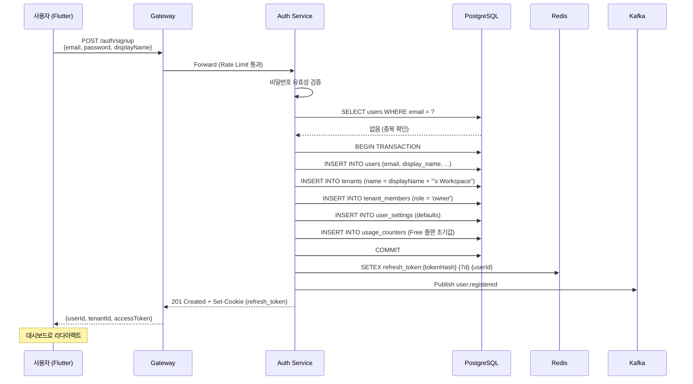

---

## 5.2 OAuth 로그인 + MFA 검증

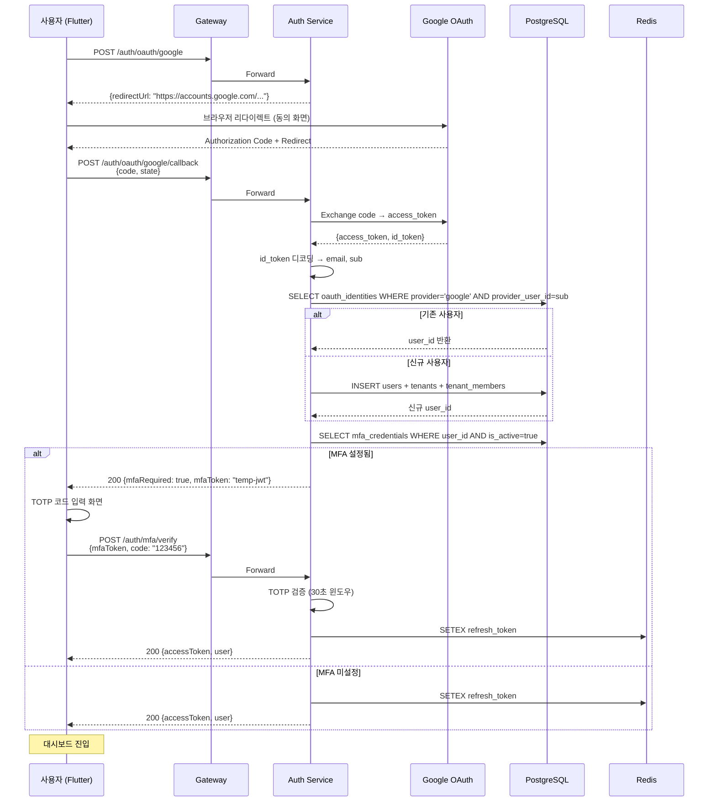

---

## 5.3 노트 작성 + 위키링크 + 백링크 갱신

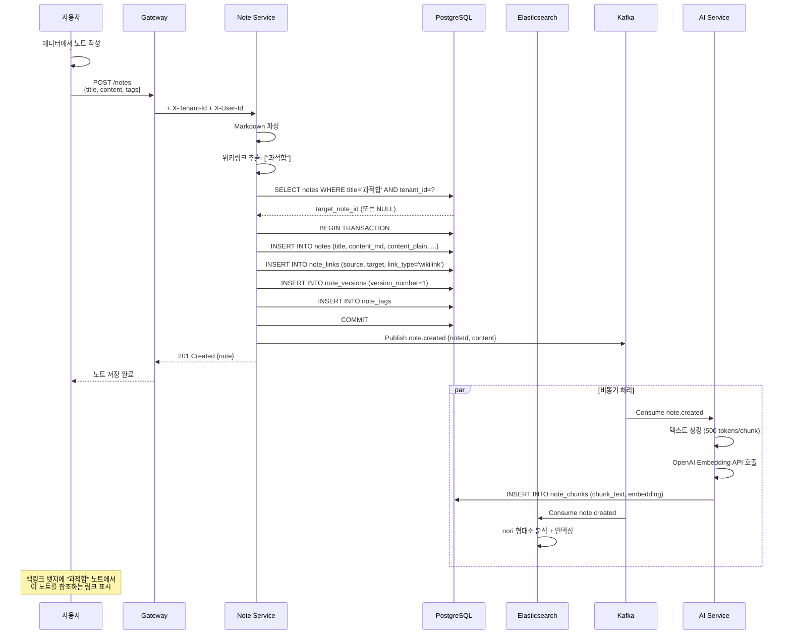

---

## 5.4 AI 카드 자동 생성 (LLM + Cache)

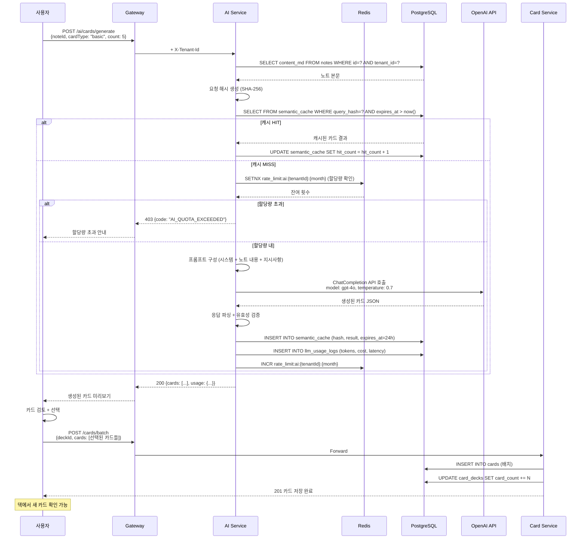

---

## 5.5 복습 세션 (SRS 스케줄링)

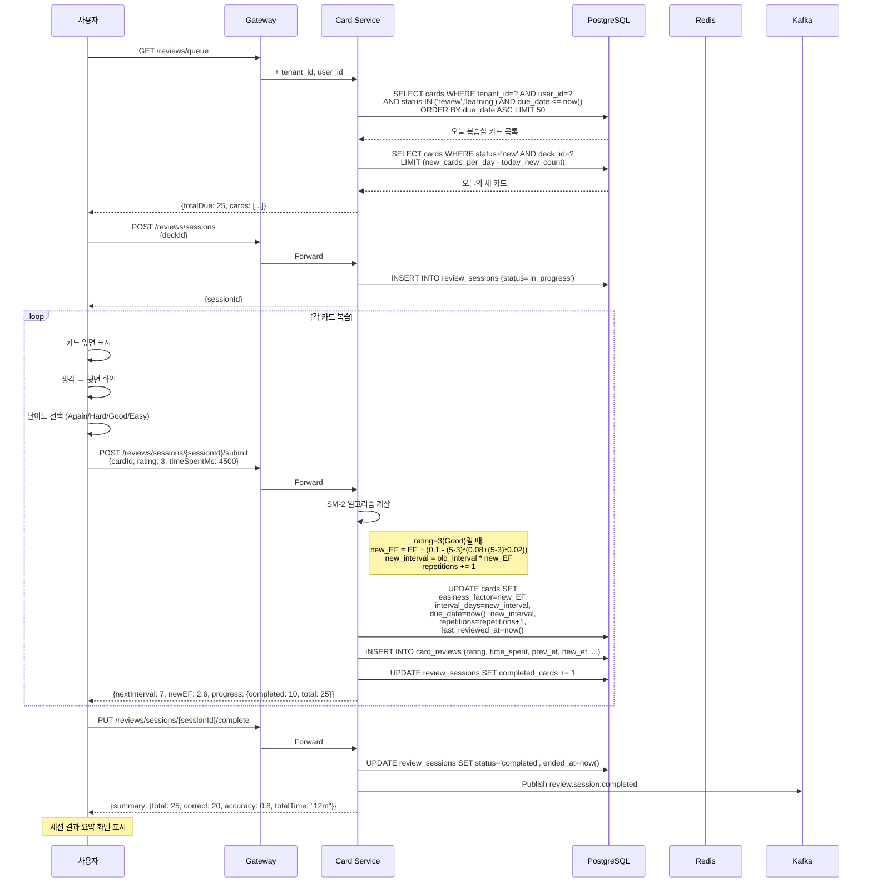

---

## 5.6 시맨틱 검색 (Hybrid Retrieval)

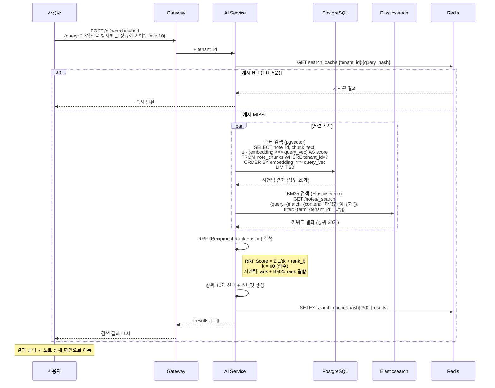

---

## 5.7 Stripe 결제 (Checkout + Webhook)

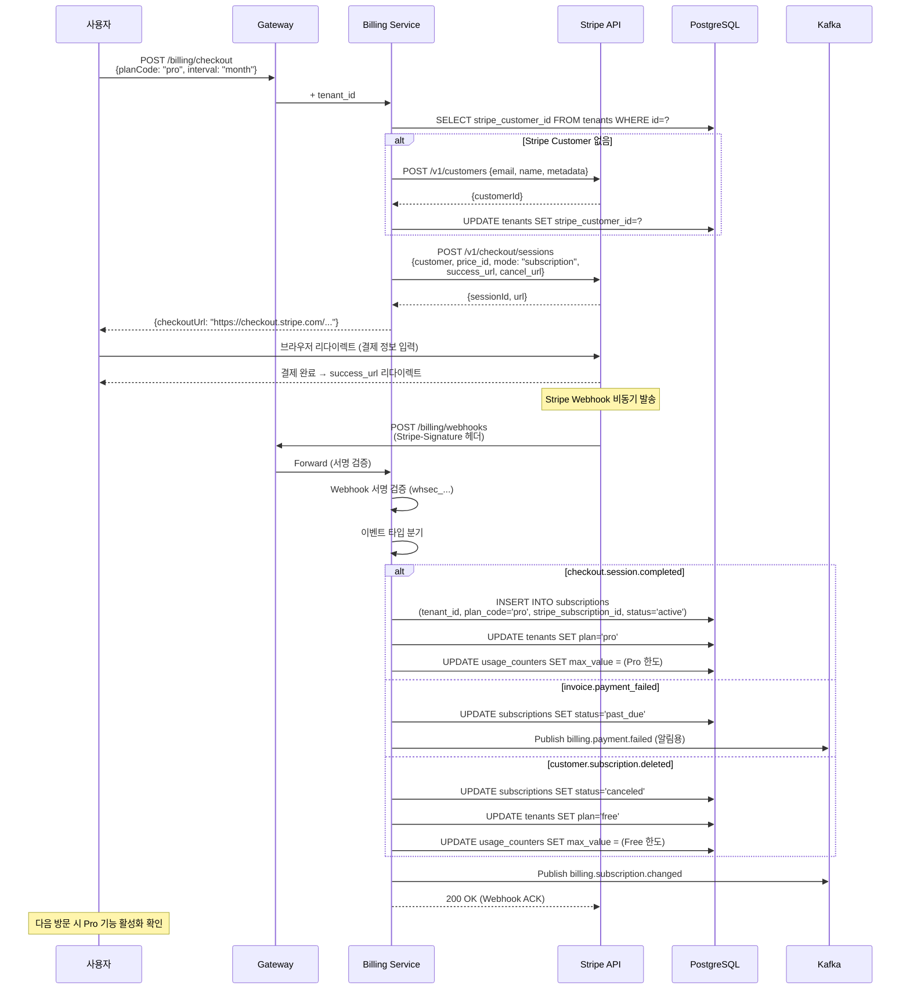

---

## 5.8 데이터 내보내기 (GDPR)

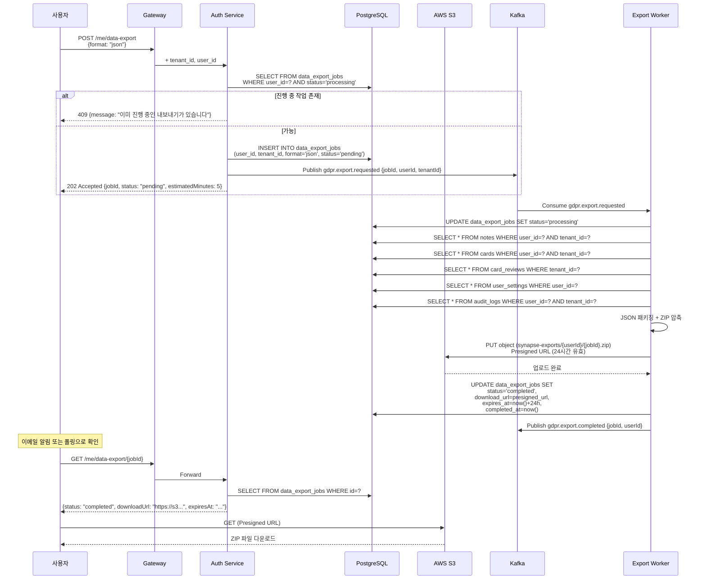

---

## 5.9 덱 공유 + 복사

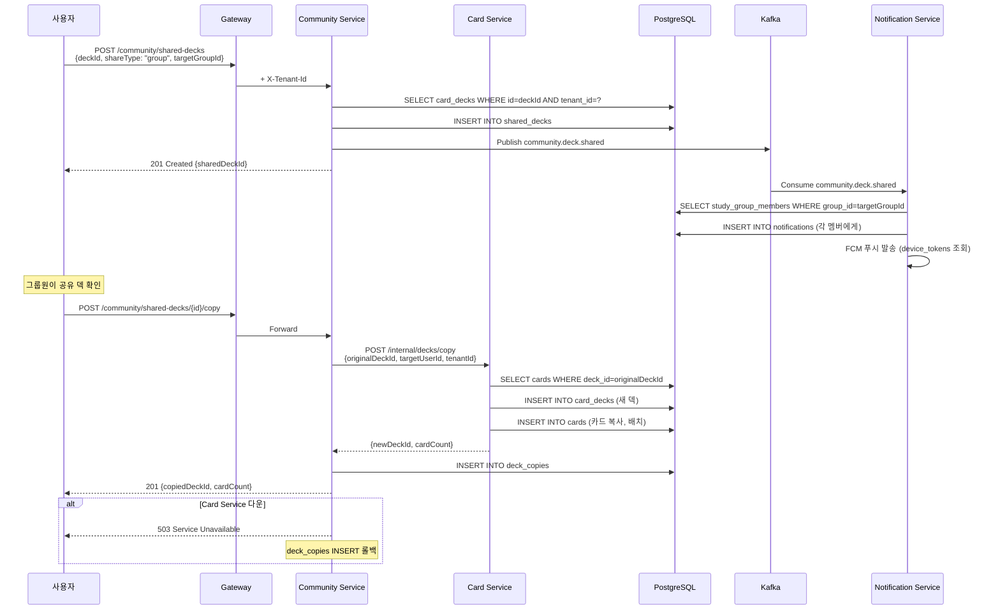

---

## 5.10 스터디 그룹 생성 + 가입

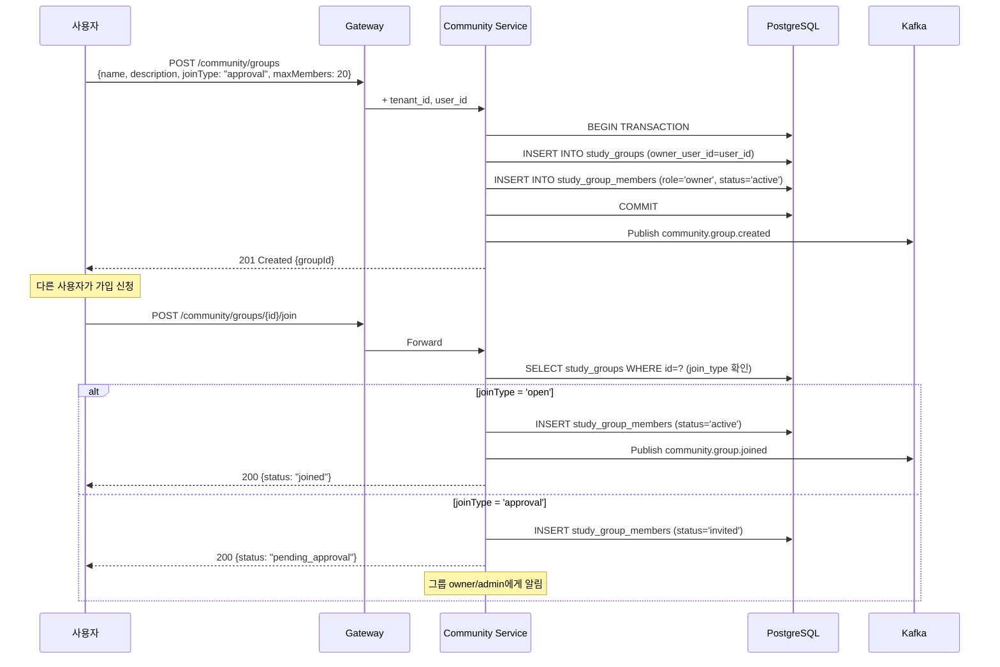

---

## 5.11 XP 적립 + 레벨업

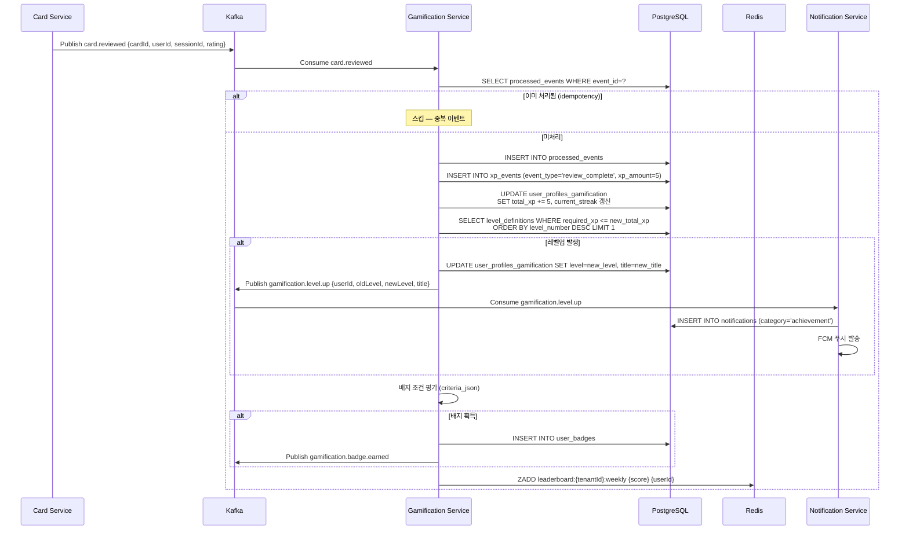

---

## 5.12 알림 발송 (복습 리마인더)

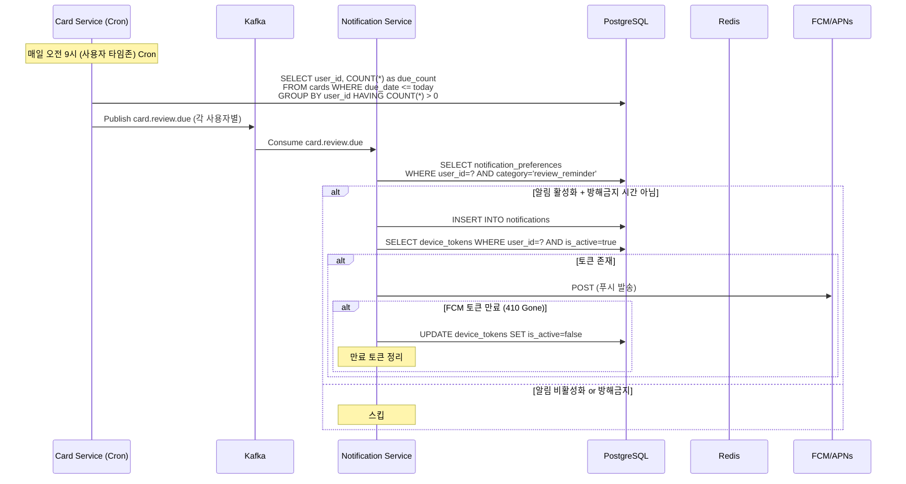

---

## 5.13 흐름 요약 매트릭스

| 흐름 | 동기/비동기 | 주요 서비스 | 외부 의존 | 예상 응답 시간 |
|------|-------------|-------------|-----------|---------------|
| 회원가입 | 동기 | Auth | - | < 500ms |
| OAuth + MFA | 동기 | Auth | Google/GitHub | < 2s |
| 노트 작성 | 동기 + 비동기 | Note, AI | OpenAI | 동기 < 300ms |
| AI 카드 생성 | 동기 | AI | OpenAI | 2-5s |
| 복습 세션 | 동기 | Card | - | < 100ms/카드 |
| 시맨틱 검색 | 동기 | AI | - | < 500ms |
| Stripe 결제 | 동기 + 비동기 | Billing | Stripe | 리다이렉트 |
| 데이터 내보내기 | 비동기 | Auth, Worker | S3 | 1-10분 |
| 덱 공유+복사 | 동기 | Community, Card | - | < 500ms (복사 시 1-2s) |
| 그룹 생성+가입 | 동기 | Community | - | < 300ms |
| XP+레벨업 | 비동기 | Gamification | - | 이벤트 처리 < 1s |
| 알림 발송 | 비동기 | Notification | FCM/APNs | 이벤트 처리 < 2s |
