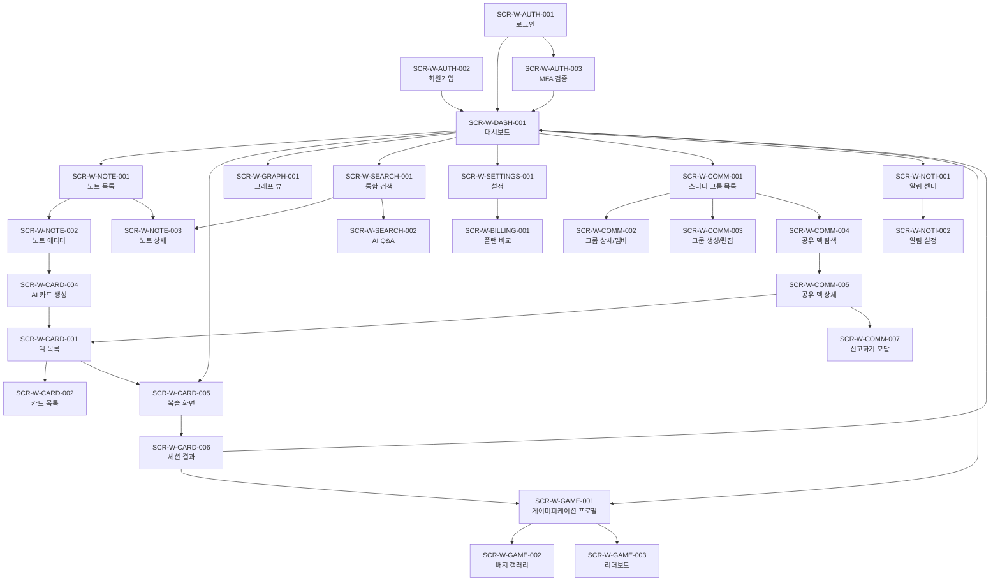

# 6. 화면 기능 정의서

> **프로젝트명**: Synapse — 통합 학습-지식 그래프 SaaS
> **버전**: v1.0
> **작성일**: 2026-05-07
> **기술 스택**: Spring Boot 4, Flutter 3.x, FastAPI, PostgreSQL 16, Redis, Elasticsearch, Kafka, K8s

---

## 6.1 화면 ID 체계

### 네이밍 규칙

```
SCR-{플랫폼}-{영역}-{순번}

플랫폼: W (Web), M (Mobile), A (Admin)
영역: AUTH, DASH, NOTE, CARD, GRAPH, SEARCH, BILLING, SETTINGS, ADMIN
순번: 3자리 숫자 (001~)
```

### 예시

| ID | 설명 |
|----|------|
| SCR-W-AUTH-001 | Web 로그인 화면 |
| SCR-M-NOTE-003 | Mobile 노트 편집 화면 |
| SCR-A-ADMIN-001 | Admin 대시보드 |

---

## 6.2 화면 인벤토리

### AUTH 영역

| ID | 화면명 | 설명 | 플랫폼 |
|----|--------|------|--------|
| SCR-W-AUTH-001 | 로그인 | 이메일/OAuth 로그인 | Web/Mobile |
| SCR-W-AUTH-002 | 회원가입 | 이메일 회원가입 | Web/Mobile |
| SCR-W-AUTH-003 | MFA 검증 | TOTP 코드 입력 | Web/Mobile |
| SCR-W-AUTH-004 | 비밀번호 재설정 | 이메일 인증 → 재설정 | Web/Mobile |
| SCR-W-AUTH-005 | OAuth 동의 | 권한 동의 화면 | Web/Mobile |

### DASH 영역

| ID | 화면명 | 설명 | 플랫폼 |
|----|--------|------|--------|
| SCR-W-DASH-001 | 메인 대시보드 | 오늘의 복습, 최근 노트, 통계 | Web/Mobile |
| SCR-W-DASH-002 | 학습 히트맵 | GitHub 스타일 학습 기록 | Web |
| SCR-W-DASH-003 | 통계 상세 | 리텐션, 정확도, 시간 차트 | Web/Mobile |

### NOTE 영역

| ID | 화면명 | 설명 | 플랫폼 |
|----|--------|------|--------|
| SCR-W-NOTE-001 | 노트 목록 | 검색/필터/정렬 | Web/Mobile |
| SCR-W-NOTE-002 | 노트 에디터 | Markdown + 위키링크 | Web |
| SCR-M-NOTE-002 | 노트 에디터 (모바일) | 모바일 최적화 에디터 | Mobile |
| SCR-W-NOTE-003 | 노트 상세 보기 | 렌더링 + 백링크 패널 | Web/Mobile |
| SCR-W-NOTE-004 | 버전 이력 | Diff 비교 | Web |
| SCR-W-NOTE-005 | 태그 관리 | 태그 CRUD + 필터 | Web/Mobile |

### CARD 영역

| ID | 화면명 | 설명 | 플랫폼 |
|----|--------|------|--------|
| SCR-W-CARD-001 | 덱 목록 | 덱 카드, 진행도 표시 | Web/Mobile |
| SCR-W-CARD-002 | 카드 목록 | 덱 내 카드 브라우저 | Web |
| SCR-W-CARD-003 | 카드 생성/편집 | Basic/Cloze 타입 | Web/Mobile |
| SCR-W-CARD-004 | AI 카드 생성 | 노트 선택 → 미리보기 → 저장 | Web/Mobile |
| SCR-W-CARD-005 | 복습 화면 | 스와이프 카드 + 난이도 선택 | Web/Mobile |
| SCR-W-CARD-006 | 세션 결과 | 정확도, 시간, 다음 복습 예정 | Web/Mobile |

### GRAPH 영역

| ID | 화면명 | 설명 | 플랫폼 |
|----|--------|------|--------|
| SCR-W-GRAPH-001 | 그래프 뷰 | D3.js 노드-엣지 시각화 | Web |
| SCR-W-GRAPH-002 | 노트 이웃 | 특정 노트 중심 로컬 그래프 | Web/Mobile |
| SCR-W-GRAPH-003 | 클러스터 뷰 | 자동 감지 토픽 클러스터 | Web |

### SEARCH 영역

| ID | 화면명 | 설명 | 플랫폼 |
|----|--------|------|--------|
| SCR-W-SEARCH-001 | 통합 검색 | 키워드 + 시맨틱 하이브리드 | Web/Mobile |
| SCR-W-SEARCH-002 | AI Q&A | RAG 기반 질문 응답 (스트리밍) | Web/Mobile |

### BILLING 영역

| ID | 화면명 | 설명 | 플랫폼 |
|----|--------|------|--------|
| SCR-W-BILLING-001 | 플랜 비교 | 기능 비교 테이블 | Web |
| SCR-W-BILLING-002 | 사용량 현황 | 쿼터 사용량 시각화 | Web/Mobile |
| SCR-W-BILLING-003 | 결제 이력 | 인보이스 목록 | Web |

### SETTINGS 영역

| ID | 화면명 | 설명 | 플랫폼 |
|----|--------|------|--------|
| SCR-W-SETTINGS-001 | 프로필 설정 | 이름, 아바타, 언어 | Web/Mobile |
| SCR-W-SETTINGS-002 | 보안 설정 | MFA, 비밀번호, 연결된 계정 | Web |
| SCR-W-SETTINGS-003 | 알림 설정 | 푸시/이메일 알림 | Web/Mobile |
| SCR-W-SETTINGS-004 | 데이터 관리 | 내보내기/가져오기/삭제 | Web |
| SCR-W-SETTINGS-005 | 테넌트 관리 | 멤버 초대, 역할 관리 | Web |

### ADMIN 영역

| ID | 화면명 | 설명 | 플랫폼 |
|----|--------|------|--------|
| SCR-A-ADMIN-001 | 관리자 대시보드 | 시스템 통계, 알림 | Web |
| SCR-A-ADMIN-002 | 테넌트 관리 | 목록/상세/상태 변경 | Web |
| SCR-A-ADMIN-003 | 사용자 관리 | 검색/상세/정지 | Web |
| SCR-A-ADMIN-004 | 감사 로그 | 이벤트 검색/필터 | Web |
| SCR-A-ADMIN-005 | 시스템 설정 | 플랜 쿼터, 기능 플래그 | Web |

### COMMUNITY 영역

| ID | 화면명 | 설명 | 플랫폼 |
|----|--------|------|--------|
| SCR-W-COMM-001 | 스터디 그룹 목록 | 내 그룹 + 그룹 탐색 | Web/Mobile |
| SCR-W-COMM-002 | 그룹 상세/멤버 | 멤버 목록, 공유 덱/노트, 활동 | Web/Mobile |
| SCR-W-COMM-003 | 그룹 생성/편집 | 이름, 설명, 가입 방식, 최대 인원 | Web/Mobile |
| SCR-W-COMM-004 | 공유 덱 탐색 | 검색, 필터, 평점, 다운로드 수 | Web/Mobile |
| SCR-W-COMM-005 | 공유 덱 상세 | 카드 미리보기, 복사, 평가 | Web/Mobile |
| SCR-W-COMM-006 | 공유 노트 탐색 | 검색, 필터 | Web/Mobile |
| SCR-W-COMM-007 | 신고하기 모달 | 신고 사유 선택/입력 | Web/Mobile |

### GAMIFICATION 영역

| ID | 화면명 | 설명 | 플랫폼 |
|----|--------|------|--------|
| SCR-W-GAME-001 | 내 프로필 (게이미피케이션) | 레벨, XP 바, 배지, 스트릭 | Web/Mobile |
| SCR-W-GAME-002 | 배지 갤러리 | 전체 배지 목록, 획득/미획득 상태 | Web/Mobile |
| SCR-W-GAME-003 | 리더보드 | 전체/그룹/주간/월간 탭 | Web/Mobile |
| SCR-W-GAME-004 | 레벨업 축하 모달 | 애니메이션 + 보상 안내 | Web/Mobile |

### NOTIFICATION 영역

| ID | 화면명 | 설명 | 플랫폼 |
|----|--------|------|--------|
| SCR-W-NOTI-001 | 알림 센터 | 알림 목록, 읽음/미읽음, 카테고리 필터 | Web/Mobile |
| SCR-W-NOTI-002 | 알림 설정 | 카테고리별 push/email/in_app on/off | Web/Mobile |

### ADMIN 확장

| ID | 화면명 | 설명 | 플랫폼 |
|----|--------|------|--------|
| SCR-A-ADMIN-006 | 신고 관리 | 목록/상세/처리(warn/suspend/remove/dismiss) | Web |
| SCR-A-ADMIN-007 | 콘텐츠 모더레이션 | 공유 덱/노트 관리, 상태 변경 | Web |
| SCR-A-ADMIN-008 | 스터디 그룹 관리 | 목록/정지/활성화 | Web |
| SCR-A-ADMIN-009 | 게이미피케이션 관리 | 배지/레벨/XP 설정 CRUD | Web |

---

## 6.3 주요 화면 상세 및 목업

### SCR-W-DASH-001: 메인 대시보드

```
+------------------------------------------------------------------+
|  [=] Synapse           [검색...]            [알림🔔] [프로필 ▼]    |
+------------------------------------------------------------------+
|         |                                                         |
| [사이드] |  ┌─── 오늘의 복습 ────────────────────────────────┐    |
| [바]    |  │  📚 복습할 카드: 25장                           │    |
|         |  │  ├─ 복습 대기: 15장                             │    |
|         |  │  ├─ 학습 중: 5장                                │    |
| 대시보드 |  │  └─ 새 카드: 5장                                │    |
| 노트    |  │                                                 │    |
| 카드    |  │  [ ▶ 복습 시작하기 ]                             │    |
| 그래프  |  └─────────────────────────────────────────────────┘    |
| 검색    |                                                         |
| 설정    |  ┌─── 학습 통계 ────────┐  ┌─── 연속 학습 ────────┐    |
|         |  │  이번 주: 150장 복습  │  │  🔥 연속 7일!         │    |
|         |  │  정확도: 85%          │  │                       │    |
|         |  │  평균 시간: 12분/일   │  │  [월][화][수][목]...  │    |
|         |  └──────────────────────┘  └──────────────────────┘    |
|         |                                                         |
|         |  ┌─── 최근 노트 ───────────────────────────────────┐    |
|         |  │  • ML 정규화 기법          5분 전              │    |
|         |  │  • TCP/UDP 비교            2시간 전            │    |
|         |  │  • 디자인 패턴 정리        어제                │    |
|         |  │                                                 │    |
|         |  │  [ + 새 노트 작성 ]                             │    |
|         |  └─────────────────────────────────────────────────┘    |
+------------------------------------------------------------------+
```

**기능 상세:**

| 요소 | 동작 | API |
|------|------|-----|
| 복습 시작 버튼 | 복습 큐 화면으로 이동 | GET /reviews/queue |
| 학습 통계 | 주간/월간 토글 | GET /stats/overview |
| 최근 노트 목록 | 클릭 → 노트 상세 | GET /notes?sort=updated_at:desc&limit=5 |
| 새 노트 작성 | 에디터 화면으로 이동 | - |
| 연속 학습 | 히트맵 클릭 → 상세 | GET /stats/heatmap |

---

### SCR-W-NOTE-002: 노트 에디터 (위키링크)

```
+------------------------------------------------------------------+
|  [←] 노트로 돌아가기     [저장] [미리보기] [···]                  |
+------------------------------------------------------------------+
|                                                                    |
|  제목: [ ML 정규화 기법                                    ]       |
|  태그: [ #머신러닝 ] [ #정규화 ] [ + 추가 ]                        |
|                                                                    |
+------------------------------------------------------------------+
|  에디터                        |  백링크 패널                      |
|                                |                                   |
|  # ML 정규화 기법              |  ◀ 이 노트를 참조하는 노트 (3)  |
|                                |                                   |
|  ## 개요                       |  ┌─────────────────────────┐     |
|  [[과적합]]을 방지하기 위한    |  │ 📄 딥러닝 기초           │     |
|  기법들을 정리한다.            |  │ "...[[ML 정규화 기법]]   │     |
|                                |  │  을 참조하여..."         │     |
|  ## L1 정규화 (Lasso)          |  └─────────────────────────┘     |
|  가중치의 절대값 합을          |  ┌─────────────────────────┐     |
|  페널티로 부과                 |  │ 📄 모델 최적화           │     |
|                                |  │ "...정규화는 [[ML 정규화 │     |
|  ## L2 정규화 (Ridge)          |  │  기법]] 참고..."         │     |
|  [[가중치]]의 제곱합을         |  └─────────────────────────┘     |
|  페널티로 부과                 |                                   |
|                                |  ▶ 이 노트가 참조하는 노트 (2)  |
|  ## [[드롭아웃]]               |  • 과적합                         |
|  훈련 시 뉴런을 무작위 비활성  |  • 가중치                         |
|                                |  • 드롭아웃 (미생성)              |
|  ---                           |                                   |
|  > 참고: [[과적합]] 문서의     |  [ 🤖 AI 카드 생성 ]             |
|  > 예시를 함께 볼 것           |                                   |
|                                |                                   |
+------------------------------------------------------------------+
|  위키링크 자동완성:                                                |
|  ┌──────────────────────────┐                                     |
|  │ 📄 과적합                 │ ← [[ 입력 시 노트 목록 표시       |
|  │ 📄 과적합 방지            │                                    |
|  │ 📄 과적합 vs 과소적합     │                                    |
|  └──────────────────────────┘                                     |
+------------------------------------------------------------------+
```

**기능 상세:**

| 요소 | 동작 | API |
|------|------|-----|
| `[[` 입력 | 위키링크 자동완성 팝업 | GET /notes?q={keyword}&limit=10 |
| 저장 버튼 | 노트 저장 + 링크 갱신 | PUT /notes/{id} |
| 백링크 패널 | 실시간 백링크 표시 | GET /notes/{id}/backlinks |
| 미생성 링크 | 클릭 → 새 노트 생성 | POST /notes |
| AI 카드 생성 | AI 카드 생성 화면 이동 | POST /ai/cards/generate |
| 미리보기 | Markdown 렌더링 토글 | 클라이언트 사이드 |

---

### SCR-W-CARD-005: 복습 화면 (스와이프 카드)

```
+------------------------------------------------------------------+
|  [×] 세션 종료              덱: 프로그래밍    10 / 25              |
+------------------------------------------------------------------+
|                                                                    |
|                                                                    |
|         ┌──────────────────────────────────────────┐              |
|         │                                          │              |
|         │                                          │              |
|         │         TCP와 UDP의 주요 차이점은?       │              |
|         │                                          │              |
|         │                                          │              |
|         │                                          │              |
|         │                                          │              |
|         │                                          │              |
|         │     [ 👁 답 보기 ]                       │              |
|         │                                          │              |
|         │                                          │              |
|         └──────────────────────────────────────────┘              |
|                                                                    |
|         출처: TCP/UDP 비교 노트 📄                                 |
|                                                                    |
+------------------------------------------------------------------+

    ↓ 답 보기 클릭 후 ↓

+------------------------------------------------------------------+
|  [×] 세션 종료              덱: 프로그래밍    10 / 25              |
+------------------------------------------------------------------+
|                                                                    |
|         ┌──────────────────────────────────────────┐              |
|         │  Q: TCP와 UDP의 주요 차이점은?           │              |
|         │──────────────────────────────────────────│              |
|         │  A:                                      │              |
|         │  • TCP: 연결 지향, 신뢰성 보장,          │              |
|         │    순서 보장, 흐름/혼잡 제어              │              |
|         │  • UDP: 비연결, 빠른 속도,               │              |
|         │    순서 미보장, 실시간 적합               │              |
|         │                                          │              |
|         └──────────────────────────────────────────┘              |
|                                                                    |
|         소요 시간: 4.5초                                           |
|                                                                    |
|  ┌──────┐  ┌──────┐  ┌──────┐  ┌──────┐                         |
|  │Again │  │ Hard │  │ Good │  │ Easy │                          |
|  │ <1분 │  │  3일 │  │  7일 │  │ 14일 │                          |
|  │ (1)  │  │ (2)  │  │ (3)  │  │ (4)  │                          |
|  └──────┘  └──────┘  └──────┘  └──────┘                         |
|                                                                    |
+------------------------------------------------------------------+
```

**기능 상세:**

| 요소 | 동작 | API |
|------|------|-----|
| 답 보기 | 뒷면 표시 + 타이머 정지 | 클라이언트 |
| 난이도 버튼 | 결과 제출 + 다음 카드 | POST /reviews/sessions/{id}/submit |
| 출처 노트 링크 | 원본 노트로 이동 | GET /notes/{sourceNoteId} |
| 세션 종료 | 확인 다이얼로그 → 결과 | PUT /reviews/sessions/{id}/complete |
| 스와이프 (모바일) | 좌=Again, 우=Good | 동일 API |
| 키보드 (웹) | 1/2/3/4 단축키 | 동일 API |

---

### SCR-W-GRAPH-001: 그래프 뷰

```
+------------------------------------------------------------------+
|  [=] Synapse > 그래프       [필터 ▼] [클러스터] [줌: +/-/Fit]     |
+------------------------------------------------------------------+
|                                                                    |
|                          (과적합)                                  |
|                         /        \                                 |
|                        /          \                                |
|              (정규화 기법)    (모델 평가)                          |
|               /    |    \          |                               |
|              /     |     \         |                               |
|        (L1) (L2) (드롭아웃)  (교차검증)                           |
|              \     |     /                                         |
|               \    |    /                                          |
|            (가중치 초기화)                                         |
|                    |                                               |
|              (경사하강법)                                          |
|               /         \                                          |
|        (학습률)      (옵티마이저)                                  |
|                          |                                         |
|                      (Adam)                                        |
|                                                                    |
+------------------------------------------------------------------+
|  선택: 정규화 기법                                                 |
|  ├─ 연결: 6개 (in: 2, out: 4)                                     |
|  ├─ PageRank: 0.85 (상위 5%)                                      |
|  ├─ 카드: 12장 (복습률 80%)                                       |
|  └─ [ 노트 열기 ] [ AI 카드 생성 ] [ 이웃 확장 ]                 |
+------------------------------------------------------------------+
```

**기능 상세:**

| 요소 | 동작 | API |
|------|------|-----|
| 노드 클릭 | 하단 패널에 노트 정보 표시 | GET /notes/{id} |
| 노드 더블클릭 | 노트 상세 화면 이동 | - |
| 필터 | 태그/날짜/연결수 필터 | GET /graph/data?tags=...&minLinks=2 |
| 클러스터 | 자동 감지 클러스터 색상 구분 | GET /graph/clusters |
| 이웃 확장 | 2-hop 이웃 노드 로드 | GET /graph/neighbors/{id}?depth=2 |
| 줌/패닝 | D3.js 줌 동작 | 클라이언트 |
| 노트 열기 | 노트 에디터로 이동 | - |

---

### SCR-W-COMM-001: 스터디 그룹 목록

```
+------------------------------------------------------------------+
|  [=] Synapse > 커뮤니티         [검색...]        [알림🔔] [프로필 ▼] |
+------------------------------------------------------------------+
|  [ 내 그룹 ] [ 그룹 탐색 ]                                        |
+------------------------------------------------------------------+
|                                                                    |
|  ┌─── 내 그룹 (3) ────────────────────────────────────────────┐   |
|  │                                                             │   |
|  │  ┌──────────────────────────────────────────────────────┐  │   |
|  │  │  AWS 자격증 스터디                    👥 8 / 20 명   │  │   |
|  │  │  멤버: 나, 홍길동 외 6명              📚 덱 3개 공유  │  │   |
|  │  │  마지막 활동: 2시간 전                                │  │   |
|  │  │                                [ 입장하기 ]           │  │   |
|  │  └──────────────────────────────────────────────────────┘  │   |
|  │                                                             │   |
|  │  ┌──────────────────────────────────────────────────────┐  │   |
|  │  │  알고리즘 마스터즈                    👥 15 / 30 명  │  │   |
|  │  │  멤버: 나, 김개발 외 13명             📚 덱 7개 공유  │  │   |
|  │  │  마지막 활동: 어제                                    │  │   |
|  │  │                                [ 입장하기 ]           │  │   |
|  │  └──────────────────────────────────────────────────────┘  │   |
|  │                                                             │   |
|  └─────────────────────────────────────────────────────────────┘  |
|                                                                    |
|  [ + 새 그룹 만들기 ]                                              |
|                                                                    |
+------------------------------------------------------------------+
```

**기능 상세:**

| 요소 | 동작 | API |
|------|------|-----|
| 내 그룹 탭 | 가입된 그룹 목록 | GET /community/groups?member=me |
| 그룹 탐색 탭 | 공개 그룹 검색/필터 | GET /community/groups?type=public |
| 입장하기 버튼 | 그룹 상세 화면 이동 | - |
| 새 그룹 만들기 | 그룹 생성 화면 이동 | - |

---

### SCR-W-GAME-001: 게이미피케이션 프로필

```
+------------------------------------------------------------------+
|  [=] Synapse > 내 프로필                   [알림🔔] [프로필 ▼]    |
+------------------------------------------------------------------+
|                                                                    |
|  ┌─── 레벨 & XP ────────────────────────────────────────────┐    |
|  │                                                           │    |
|  │  [아바타]   개발자 김시냅스                               │    |
|  │             🏅 레벨 7 — 지식 탐험가                       │    |
|  │                                                           │    |
|  │  XP  ████████████████░░░░░░  3,240 / 5,000               │    |
|  │       (다음 레벨까지 1,760 XP)                            │    |
|  │                                                           │    |
|  │  🔥 연속 학습: 14일째                                     │    |
|  │                                                           │    |
|  └───────────────────────────────────────────────────────────┘    |
|                                                                    |
|  ┌─── 획득한 배지 (12 / 30) ─────────────────────────────────┐    |
|  │                                                           │    |
|  │  [🌱] [📖] [⚡] [🔥] [🏆] [💡] [🌟] ···                  │    |
|  │  씨앗  독서가 스피드 연속7  마스터  아이디어 탐험가          │    |
|  │                                                           │    |
|  │                          [ 배지 갤러리 전체 보기 → ]       │    |
|  └───────────────────────────────────────────────────────────┘    |
|                                                                    |
|  ┌─── 이번 주 학습 현황 ─────────────────────────────────────┐    |
|  │  복습 카드: 152장   노트: 8개    XP 획득: +420             │    |
|  │                          [ 리더보드 보기 → ]               │    |
|  └───────────────────────────────────────────────────────────┘    |
|                                                                    |
+------------------------------------------------------------------+
```

**기능 상세:**

| 요소 | 동작 | API |
|------|------|-----|
| XP 진행 바 | 현재/다음 레벨 XP 표시 | GET /gamification/profile |
| 배지 갤러리 이동 | 배지 갤러리 화면 | GET /gamification/badges |
| 리더보드 이동 | 리더보드 화면 | GET /gamification/leaderboard |
| 연속 학습 스트릭 | 연속 일수 표시 | GET /gamification/streak |

---

### SCR-W-NOTI-001: 알림 센터

```
+------------------------------------------------------------------+
|  [=] Synapse > 알림 센터                   [설정 ⚙] [모두 읽음]  |
+------------------------------------------------------------------+
|  [ 전체 ] [ 복습 ] [ 커뮤니티 ] [ 성취 ]                          |
+------------------------------------------------------------------+
|                                                                    |
|  ┌─── 오늘 ──────────────────────────────────────────────────┐    |
|  │                                                           │    |
|  │  🔵 [🏆] 레벨업! 지식 탐험가로 성장했습니다        1시간 전│    |
|  │      레벨 6 → 레벨 7 달성                                │    |
|  │                                                           │    |
|  │  ○  [📚] AWS 자격증 스터디에 새 덱이 공유되었습니다  3시간 전│    |
|  │      홍길동님이 "EC2 심화" 덱을 공유했습니다              │    |
|  │                                     [ 덱 확인하기 → ]    │    |
|  │                                                           │    |
|  │  ○  [🔔] 오늘 복습할 카드가 25장 있습니다         오전 9시│    |
|  │      AWS SAA 덱 외 2개 덱                                 │    |
|  │                                     [ 복습 시작 → ]      │    |
|  │                                                           │    |
|  └───────────────────────────────────────────────────────────┘    |
|                                                                    |
|  ┌─── 어제 ──────────────────────────────────────────────────┐    |
|  │  ○  [🎖] 배지 획득: "연속 학습 7일"               어제    │    |
|  │  ○  [👥] 김개발님이 스터디 그룹 가입 신청          어제    │    |
|  └───────────────────────────────────────────────────────────┘    |
|                                                                    |
+------------------------------------------------------------------+
```

**기능 상세:**

| 요소 | 동작 | API |
|------|------|-----|
| 카테고리 탭 | 알림 필터링 | GET /notifications?category={type} |
| 알림 항목 클릭 | 관련 화면 이동 + 읽음 처리 | PUT /notifications/{id}/read |
| 모두 읽음 | 전체 읽음 처리 | PUT /notifications/read-all |
| 설정 버튼 | 알림 설정 화면 이동 | - |

---

## 6.4 화면 전환 맵



---

## 6.5 반응형 브레이크포인트

| 구분 | 폭 | 레이아웃 |
|------|-----|----------|
| Mobile | < 600px | 단일 컬럼, 바텀 네비게이션 |
| Tablet | 600-1024px | 2컬럼, 접이식 사이드바 |
| Desktop | > 1024px | 3컬럼, 고정 사이드바 |

---

## 6.6 공통 UI 컴포넌트

| 컴포넌트 | 사용 화면 | 설명 |
|----------|-----------|------|
| AppBar | 전체 | 로고, 검색, 알림, 프로필 |
| SideNav | Desktop/Tablet | 주요 메뉴 네비게이션 (240px, collapsed: 56px) |
| BottomNav | Mobile | 4개 탭: 홈/노트/복습/더보기 |
| **CommandPalette** | 전체 (Cmd+K) | 모든 기능 검색+실행. 키보드 우선 UX |
| **OnboardingChecklist** | 대시보드 | 3단계: 첫 노트→첫 카드→첫 복습. TTFV 5분 목표 |
| **AutoSaveIndicator** | 에디터 상단 | "저장됨" 텍스트, 2초 후 페이드 아웃 |
| NoteCard | 목록 화면 | 노트 미리보기 카드 |
| DeckCard | 덱 목록 | 덱 정보 + 진행도 바 |
| FlashCard | 복습 화면 | 앞/뒤 3D 플립 카드 (Y축 회전, 300ms spring) |
| **ReviewDifficultyBar** | 복습 화면 | 4단계: Again(1) / Hard(2) / Good(3) / Easy(4) — SM-2 rating 매핑 |
| **CelebrationParticle** | 복습 완료 시 | 파티클 축하 애니메이션 (600ms) |
| **AIGenerateLoading** | AI 카드 생성 | 스켈레턴 UI + "카드를 만들고 있어요..." + 진행률 바 |
| WikilinkChip | 에디터/상세 | `[[링크]]` 시각화 칩 + 미리보기 (첫 2줄) |
| TagChip | 에디터/목록 | 태그 표시/필터 칩 |
| QuotaBar | 대시보드/설정 | 사용량 진행도 바 |
| EmptyState | 전체 | 빈 상태 안내 + CTA 버튼 (따뜻한 톤) |
| **EmptyGraphState** | 그래프 뷰 | "첫 노트를 작성하면 지식 그래프가 나타납니다" + CTA |
| CodeBlock | 에디터/미리보기 | 마크다운 코드 블록 구문강조 (Geist Mono) |
| ConfirmDialog | 전체 | 삭제/취소 확인 다이얼로그 |
| Toast | 전체 | 성공/에러/정보 알림 |
| GroupCard | 그룹 목록 | 그룹 정보 + 멤버 수 + 가입 버튼 |
| SharedDeckCard | 공유 덱 목록 | 덱 정보 + 평점 + 다운로드 수 + 복사 버튼 |
| XPProgressBar | 프로필/대시보드 | 현재 XP / 다음 레벨 진행도 |
| BadgeIcon | 프로필/배지 갤러리 | 배지 아이콘 + 획득 상태 (color/grayscale) |
| StreakFlame | 대시보드/프로필 | 🔥 연속 학습 일수 표시 |
| LeaderboardRow | 리더보드 | 순위 + 아바타 + 이름 + 점수 |
| NotificationItem | 알림 센터 | 아이콘 + 제목 + 시간 + 읽음 상태 |
| ReportDialog | 커뮤니티 전체 | 신고 사유 선택 + 설명 입력 다이얼로그 |
| LevelUpCelebration | 레벨업 시 | 파티클 + 레벨 정보 애니메이션 (Warm Amber 색상) |

---

## 6.7 접근성 요구사항

| 항목 | 기준 | 구현 |
|------|------|------|
| 색 대비 | WCAG 2.1 AA (4.5:1) | Flutter Theme 기반 |
| 키보드 탐색 | 모든 기능 키보드 접근 가능 | FocusNode 관리 |
| 스크린 리더 | Semantics 위젯 적용 | Flutter Semantics |
| 동작 감소 | 애니메이션 감소 옵션 | MediaQuery.disableAnimations |
| 폰트 크기 | 사용자 설정 존중 | textScaleFactor 대응 |

---

## 6.8 성능 요구사항

| 화면 | 초기 로딩 | 상호작용 반응 | 비고 |
|------|-----------|---------------|------|
| 대시보드 | < 1.5s | < 100ms | 캐싱 활용 |
| 노트 에디터 | < 1s | < 50ms (타이핑) | 디바운스 저장 |
| 복습 화면 | < 500ms | < 100ms (카드 전환) | 프리페치 |
| 그래프 뷰 | < 2s (100노드) | 60fps (줌/패닝) | WebGL 가속 |
| 검색 | < 200ms | < 300ms (결과 표시) | 시맨틱 캐시 |
| 스터디 그룹 목록 | < 500ms | < 150ms | 그룹 목록 캐싱 |
| 공유 덱 탐색 | < 500ms | < 300ms (검색 결과) | ES 인덱싱 |
| 게이미피케이션 프로필 | < 500ms | < 100ms | Redis 리더보드 캐시 |
| 알림 센터 | < 300ms | < 100ms (읽음 처리) | 미읽음 배지 실시간 |
