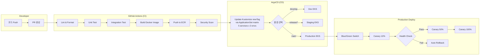
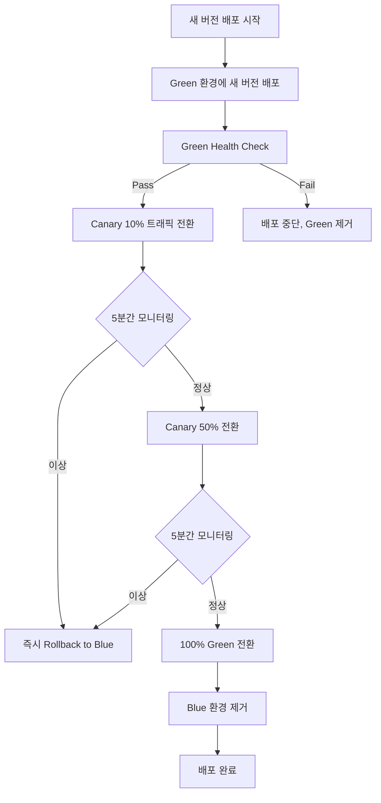

# 14. 배포 가이드

> **프로젝트명**: Synapse — 통합 학습-지식 그래프 SaaS
> **버전**: v2.0
> **작성일**: 2026-05-07
> **수정일**: 2026-05-09
> **기술 스택**: Spring Boot 4, Flutter 3.x, FastAPI, PostgreSQL 16, Redis, Elasticsearch, Kafka, K8s

> ⚠️ **v2.0 전면 개편 안내**
>
> 본 문서는 ADR-001 (10→4 서비스 통합) / ADR-002 (AI Service 통합) — 채택일 2026-05-09 — 을 반영하여 갱신되었다. 자세한 결정 근거와 운영 규칙은 `09_Git_규칙_정의서` v2.0 (§0.1 ADR 요지 / §B1 레포 구조 / §B3 GitOps + ApplicationSet / §B4 Schema Registry / Appendix A·B ADR 전문) 참조.
>
> 본 v2.0과 함께 / 이후 갱신되는 위키 문서:
>  - `09_Git_규칙_정의서` v2.0 (이미 채택 완료)
>  - `03_프로젝트_아키텍처_정의서` v2.0 (그룹 1 — 채택 완료)
>  - `18_기술_스택_정의서` v2.0 (그룹 1 — 채택 완료)
>  - `14_배포_가이드` v2.0 (그룹 2 — 본 사이클)
>  - `10_환경_설정_템플릿` v2.0 (그룹 2 — 본 사이클)
>  - `17_스케줄` v2.0 (그룹 3 — 다음 사이클)

---

## 1. CI/CD 파이프라인 개요



---

## 2. 환경 구성

### 2.1 환경별 사양

| 환경 | 클러스터 | 노드 | 용도 | 배포 트리거 |
|------|----------|------|------|-------------|
| **Local** | Docker Compose | 1 (로컬) | 개발/디버깅 | 수동 |
| **Dev** | EKS (small) | 2 x t3.medium | 통합 테스트 | develop 브랜치 Push |
| **Staging** | EKS (prod-like) | 3 x m5.large | QA/성능 테스트 | release/* 브랜치 |
| **Production** | EKS (Multi-AZ) | 6 x m5.xlarge | 운영 | main 브랜치 (승인 후) |

### 2.2 Local 환경 (Docker Compose)

```bash
# 전체 서비스 기동
docker compose -f docker-compose.dev.yml up -d

# 서비스 목록 (v2.0 4-서비스 통합)
# - api-gateway (8080)
# - synapse-platform-svc (8081 — auth + audit + billing + notification)
# - synapse-engagement-svc (8082 — community + gamification)
# - synapse-knowledge-svc (8083 — note + graph + chunking)
# - synapse-learning-card (8084 — card + srs, Java)
# - synapse-learning-ai (8090 — ai, Python/FastAPI)
# - postgresql (5432)
# - redis (6379)
# - elasticsearch (9200)
# - kafka + zookeeper (9092)
# - schema-registry (호스트 8085 → 컨테이너 8081)
# Docker Compose 풀 정의는 10_환경_설정_템플릿.md §3 참조

# 상태 확인
docker compose ps

# 로그 확인
docker compose logs -f api-gateway
```

---

## 3. 사전 요구사항

### 3.1 도구

| 도구 | 최소 버전 | 용도 |
|------|-----------|------|
| Docker | 24.x | 컨테이너 빌드 |
| kubectl | 1.28+ | 클러스터 관리 |
| Helm | 3.14+ | 차트 배포 |
| AWS CLI | 2.x | AWS 리소스 접근 |
| ArgoCD CLI | 2.10+ | GitOps 배포 |
| Flyway CLI | 10.x | DB 마이그레이션 (로컬) |
| yq | 4.x | kustomization newTag bump (deploy.yml — 09 §B3) |

### 3.2 권한

| 권한 | 대상 | 환경 |
|------|------|------|
| ECR Push | 컨테이너 레지스트리 | 전체 |
| EKS Admin | Kubernetes 클러스터 | Dev/Staging |
| EKS Deploy | 제한된 namespace | Production |
| Secrets Manager Read | AWS Secrets | 전체 |
| ArgoCD App Sync | ArgoCD 프로젝트 | Staging/Production |

---

## 4. 배포 전략

### 4.1 Blue/Green + Canary



### 4.2 Canary 판정 기준

| 지표 | 임계값 | 측정 방법 |
|------|--------|-----------|
| Error Rate | < 1% | Prometheus `http_server_requests_seconds_count{status=~"5.."}` |
| P95 Latency | < 300ms | Prometheus `http_server_requests_seconds{quantile="0.95"}` |
| Pod Restart | 0회 | `kube_pod_container_status_restarts_total` |
| Memory Usage | < 80% | `container_memory_usage_bytes / container_spec_memory_limit_bytes` |

### 4.3 Rollback 절차

```bash
# 1. 즉시 롤백 (ArgoCD)
argocd app rollback synapse-production --revision <previous>

# 2. Helm 롤백
helm rollback synapse -n production 1

# 3. 수동 Blue/Green 전환 (긴급 시)
kubectl patch service synapse-gateway -n production \
  -p '{"spec":{"selector":{"version":"blue"}}}'

# 4. 롤백 후 확인
kubectl get pods -n production -l app=synapse
curl -s https://api.synapse.app/actuator/health | jq .
```

---

> **통합 배포 태그 롤백**: 운영 배포 시점은 `synapse-gitops/v{날짜}` 통합 배포 태그(예: `synapse-gitops/v2026.05.10`)로 식별된다. 통합 태그 단위 롤백 절차는 `09_Git_규칙_정의서` v2.0 §B5 참조.

## 5. DB 마이그레이션 (Flyway)

### 5.1 Zero-Downtime 패턴

```
Phase 1: 이전 호환 스키마 추가 (ALTER ADD COLUMN, nullable)
Phase 2: 새 버전 배포 (양쪽 컬럼 모두 사용)
Phase 3: 데이터 백필 (비동기 배치)
Phase 4: 이전 컬럼 제거 (다음 릴리즈)
```

### 5.2 마이그레이션 실행

```bash
# Staging 마이그레이션 실행
flyway -url=jdbc:postgresql://staging-db:5432/synapse \
       -user=$DB_USER -password=$DB_PASSWORD \
       -locations=filesystem:./migrations \
       migrate

# 마이그레이션 상태 확인
flyway info

# 문제 발생 시: 백업에서 복구 (Forward-only 정책)
# flyway undo는 사용하지 않음 — 롤백 마이그레이션 작성 금지
```

### 5.3 마이그레이션 규칙

1. **DDL과 DML 분리**: 스키마 변경과 데이터 변경은 별도 파일
2. **Forward-only**: 롤백 마이그레이션 작성하지 않음. 문제 발생 시 ���업에서 복구
3. **Lock 최소화**: `ALTER TABLE ... ADD COLUMN` 시 `DEFAULT` 절 사용 (PG 11+)
4. **인덱스 비동기 생성**: `CREATE INDEX CONCURRENTLY` 사용
5. **파일 네이밍**: `V{version}__{description}.sql` (예: `V1.3__add_card_tags.sql`)
6. **Backward-compatible**: 무중단 배포 가능한 변경만 허용

---

## 6. Health Check

### 6.1 엔드포인트

| 서비스 | Health 엔드포인트 | Readiness | Liveness |
|---|---|---|---|
| `synapse-platform-svc` | `/actuator/health` | `/actuator/health/readiness` | `/actuator/health/liveness` |
| `synapse-engagement-svc` | `/actuator/health` | `/actuator/health/readiness` | `/actuator/health/liveness` |
| `synapse-knowledge-svc` | `/actuator/health` | `/actuator/health/readiness` | `/actuator/health/liveness` |
| `synapse-learning-card` (Java) | `/actuator/health` | `/actuator/health/readiness` | `/actuator/health/liveness` |
| `synapse-learning-ai` (FastAPI) | `/health` | `/health/ready` | `/health/live` |

### 6.2 Kubernetes Probe 설정

```yaml
livenessProbe:
  httpGet:
    path: /actuator/health/liveness
    port: 8080
  initialDelaySeconds: 30
  periodSeconds: 10
  failureThreshold: 3

readinessProbe:
  httpGet:
    path: /actuator/health/readiness
    port: 8080
  initialDelaySeconds: 10
  periodSeconds: 5
  failureThreshold: 3

startupProbe:
  httpGet:
    path: /actuator/health
    port: 8080
  initialDelaySeconds: 10
  periodSeconds: 5
  failureThreshold: 30
```

---

## 7. Post-Deploy 검증

### 7.1 Smoke Test

```bash
#!/bin/bash
# post-deploy-smoke.sh

BASE_URL="${1:-https://api.synapse.app}"

echo "=== Synapse Post-Deploy Smoke Test ==="

# 1. Health Check
echo -n "Health Check... "
STATUS=$(curl -s -o /dev/null -w "%{http_code}" "$BASE_URL/actuator/health")
[ "$STATUS" == "200" ] && echo "PASS" || echo "FAIL ($STATUS)"

# 2. Auth 엔드포인트
echo -n "Auth API... "
STATUS=$(curl -s -o /dev/null -w "%{http_code}" "$BASE_URL/api/v1/auth/status")
[ "$STATUS" == "200" ] && echo "PASS" || echo "FAIL ($STATUS)"

# 3. Note 엔드포인트 (인증 필요)
echo -n "Note API... "
STATUS=$(curl -s -o /dev/null -w "%{http_code}" -H "Authorization: Bearer $TEST_TOKEN" \
  "$BASE_URL/api/v1/notes?page=0&size=1")
[ "$STATUS" == "200" ] && echo "PASS" || echo "FAIL ($STATUS)"

# 4. Search 엔드포인트
echo -n "Search API... "
STATUS=$(curl -s -o /dev/null -w "%{http_code}" -H "Authorization: Bearer $TEST_TOKEN" \
  "$BASE_URL/api/v1/search?q=test")
[ "$STATUS" == "200" ] && echo "PASS" || echo "FAIL ($STATUS)"

# 5. AI Service
echo -n "AI Service... "
STATUS=$(curl -s -o /dev/null -w "%{http_code}" "$BASE_URL/ai/health")
[ "$STATUS" == "200" ] && echo "PASS" || echo "FAIL ($STATUS)"

echo "=== Smoke Test Complete ==="
```

### 7.2 Canary 모니터링 대시보드

배포 후 5분간 Grafana 대시보드에서 확인할 항목:

1. **Error Rate**: 5xx 응답 비율 < 1%
2. **Latency**: P50 < 100ms, P95 < 300ms, P99 < 500ms
3. **Throughput**: 이전 배포 대비 ±10% 이내
4. **Pod Status**: 모든 Pod Running, 0 Restart
5. **Memory/CPU**: 임계값 이내 (CPU < 70%, Memory < 80%)

---

## 8. Secrets 관리

### 8.1 AWS Secrets Manager 구조

```
/synapse/production/
├── database          # DB 접속 정보
├── redis             # Redis 클러스터 인증
├── elasticsearch     # ES 인증
├── stripe            # Stripe API Key
├── openai            # OpenAI API Key
├── jwt-secret        # JWT 서명 키
└── encryption-key    # 데이터 암호화 키

/synapse/staging/
├── (동일 구조)
```

### 8.2 Secret 주입 방식

```yaml
# External Secrets Operator 사용
apiVersion: external-secrets.io/v1beta1
kind: ExternalSecret
metadata:
  name: synapse-secrets
  namespace: production
spec:
  refreshInterval: 1h
  secretStoreRef:
    name: aws-secrets-manager
    kind: ClusterSecretStore
  target:
    name: synapse-app-secrets
  data:
    - secretKey: DB_PASSWORD
      remoteRef:
        key: /synapse/production/database
        property: password
    - secretKey: STRIPE_SECRET_KEY
      remoteRef:
        key: /synapse/production/stripe
        property: secret_key
```

### 8.3 Secret 교체 절차

1. AWS Secrets Manager에서 새 값 업데이트
2. External Secrets Operator가 자동 동기화 (최대 1시간)
3. 긴급 시: `kubectl rollout restart deployment/<service> -n production`
4. 교체 후 서비스 정상 동작 확인

---

## 9. 배포 체크리스트

### Production 배포 전

- [ ] Staging에서 전체 테스트 통과
- [ ] DB 마이그레이션 Staging 검증 완료
- [ ] 성능 테스트 통과 (P95 < 200ms)
- [ ] Security Scan 이상 없음
- [ ] Change Log 작성
- [ ] 롤백 계획 수립
- [ ] On-call 담당자 확인

### Production 배포 후

- [ ] Smoke Test 통과
- [ ] Canary 5분 모니터링 정상
- [ ] Error Rate < 0.1%
- [ ] 주요 비즈니스 플로우 수동 확인
- [ ] Grafana 대시보드 이상 없음
- [ ] Slack 배포 알림 발송

---

## 10. 신규 모듈 추가 절차 (4-서비스 통합 후)

v2.0 (4-서비스 통합) 패턴: 신규 도메인이 추가되면 별도 서비스 생성이 아닌 **기존 서비스 안 모듈**로 추가한다. 모듈 경계는 Spring Modulith가 강제하고 ArchUnit이 검증한다.

**1. 트랙 owner와 합의** — 어느 서비스(platform / engagement / knowledge / learning-card / learning-ai) 안의 모듈로 들어갈지 결정 (도메인 응집도 + 트랙 부하 기준). `09_Git_규칙_정의서` §0.3 매핑표 참조.

**2. 모듈 선언** — 해당 서비스 레포에 신규 패키지 + `package-info.java`로 모듈 선언:

```java
@ApplicationModule(
    displayName = "New Module",
    allowedDependencies = {"shared"}  // 또는 다른 모듈 명시
)
package com.synapse.<service>.<newmodule>;

import org.springframework.modulith.ApplicationModule;
```

**3. ArchUnit 검증** — `ApplicationModules.of(Application.class).verify()` CI 자동 통과 확인 (`18_기술_스택_정의서` §4.1.8 Spring Modulith 참조).

**4. Avro 스키마 (선택)** — Kafka 이벤트 발행이 있다면 `synapse-shared`에 .avsc PR. Schema Registry BACKWARD 호환성 검증 — `09_Git_규칙_정의서` §B4 참조.

**5. 통합 테스트** — 모듈 단위 테스트 + 영향 받는 다른 모듈과의 통합 테스트.

**6. 배포** — 기존 서비스 image 재배포 (서비스 자체 분리 없음, 새 모듈 포함된 새 image). deploy.yml의 GitOps 흐름 그대로 — `09_Git_규칙_정의서` §B3 참조.

**7. ApplicationSet 그대로** — 별도 ArgoCD Application 추가 없음. 5×3 매트릭스(5 서비스 × dev/staging/prod)가 그대로 새 image를 가져간다.

> **v1.0 → v2.0 변화**: v1.0의 "신규 서비스 배포 절차"(별도 K8s Deployment / Service / Ingress / ArgoCD App 추가)는 4-서비스 통합 후 의미 없음. 모듈 단위 추가로 갈음. owner는 해당 서비스 트랙 owner + `@team-lead` 이중 승인.

### 10.4 FCM/APNs 인증서 관리 절차

1. **FCM**: Firebase Console → Project Settings → Cloud Messaging → Server key → AWS Secrets Manager (`/synapse/production/fcm`)
2. **APNs**: Apple Developer → Certificates → Push Notification Key (.p8) → AWS Secrets Manager (`/synapse/production/apns`)
3. **키 교체**: 90일마다 갱신, External Secrets Operator가 자동 반영 (refreshInterval: 1h)

---

## 11. 긴급 배포 (Hotfix)


**긴급 배포 조건**:
- P0 장애 발생 중
- 보안 취약점 긴급 패치
- 데이터 유실 위험

**승인 권한**: 관리자 1인 이상 승인 필수

> **모듈 단위 hotfix**: Hotfix가 한 모듈만 영향 시 해당 서비스 단위로 진행 (서비스 전체 재배포가 아닌 모듈만 패치된 새 image). 영향 받는 모듈 owner와 `@team-lead` 단독 승인.

---

## 12. 변경 이력

| 버전 | 날짜 | 작성자 | 변경 내용 |
|------|------|--------|-----------|
| v1.0 | 2026-05-07 | Synapse Team | 초안 작성 |
| v1.1 | 2026-05-08 | Synapse Team | Community/Gamification/Notification 서비스 배포 절차 추가, FCM/APNs 인증서 관리 절차 추가 |
| v2.0 | 2026-05-09 | Synapse Team | ADR-001 (10→4 서비스 통합) / ADR-002 (AI Service 통합) — 채택일 2026-05-09 — 반영. 09_Git_규칙_정의서 v2.0 채택 전제. ⚠️ 주의문 추가. §1 CI/CD Mermaid에 ArgoCD ApplicationSet matrix generator 라벨 / §2.2 Local 서비스 목록 4-서비스 + Schema Registry 재작성 / §3 도구 표 yq 행 추가 / §4.3 통합 배포 태그 롤백 단락 / §6.1 Health 엔드포인트 표 5행 4-서비스 재기재 / §7.1 Smoke Test (BASE_URL 추상 — 변경 없음) / §10 "신규 모듈 추가 절차"로 전면 재구성 (10.4 FCM/APNs 인증서 관리는 §10.x로 보존) / §11 모듈 단위 hotfix 안내 추가. 직교 절(§3·§4·§5·§8·§9 본문) 보존. |
